# Iris Protocol Architecture

This document defines the architecture of the Iris Protocol, a proprietary, standalone Decentralized Terrestrial Satellite Oracle Network (DtsON). Iris enables requesters (decentralized applications or dapps) to reliably ingest, verify, and utilize Geographical Information System (GIS) data, such as satellite imagery.

## Table of Contents

- [1. System Overview: The Chain of Provenance](#1-system-overview-the-chain-of-provenance)
  - [1.1 The Provenance Pipeline](#11-the-provenance-pipeline)
  - [1.2 System Actors](#12-system-actors)
  - [1.3 Non-Goals & Scope Boundaries](#13-non-goals--scope-boundaries)
- [2. The Geodesic Reconstruction Model](#2-the-geodesic-reconstruction-model)
  - [2.1 The Analogy: A Sphere of Flat Panels](#21-the-analogy-a-sphere-of-flat-panels)
  - [2.2 Why This Analogy Matters](#22-why-this-analogy-matters)
- [3. State Machine Architecture](#3-state-machine-architecture)
  - [3.1 Layer 1 — Round State](#31-layer-1--round-state-per-request-lifecycle)
  - [3.2 Layer 2 — Node State](#32-layer-2--node-state-persistent-per-node)
  - [3.3 Layer 3 — Panel State](#33-layer-3--panel-state-the-reconstruction-output)
  - [3.4 Layer 4 — Committee State](#34-layer-4--committee-state-network-wide-slow-moving)
- [4. Network Layer](#4-network-layer)
  - [4.1 Protocol Stack](#41-protocol-stack)
  - [4.2 Transport & Security](#42-transport--security)
  - [4.3 Peer Discovery (Kademlia DHT)](#43-peer-discovery-kademlia-dht)
  - [4.4 Message Propagation (GossipSub v1.1)](#44-message-propagation-gossipsub-v11)
  - [4.5 Direct Streams — GeoTIFF Transfer Protocol](#45-direct-streams--geotiff-transfer-protocol)
  - [4.6 Message Lifecycle — A Complete Round](#46-message-lifecycle--a-complete-round)
  - [4.7 Network State Data Structure](#47-network-state-data-structure-conceptual)
  - [4.8 Configuration](#48-configuration-iristoml--network-section)
- [5. Data Provenance & Ingestion](#5-data-provenance--ingestion)
  - [5.1 The Provenance Problem](#51-the-provenance-problem)
  - [5.2 TLSNotary: MPC-Based Proof of Origin](#52-tlsnotary-mpc-based-proof-of-origin)
  - [5.3 Anatomy of a `.tlsn` Proof](#53-anatomy-of-a-tlsn-proof)
  - [5.4 Proof Verification](#54-proof-verification)
  - [5.5 Trust Assumptions & the Notary](#55-trust-assumptions--the-notary)
- [6. Data Normalization Engine](#6-data-normalization-engine-the-reconstruction-pipeline)
  - [6.1 Orthorectification](#61-orthorectification)
  - [6.2 Similarity Metrics](#62-similarity-metrics)
  - [6.3 Similarity Scoring](#63-similarity-scoring)
  - [6.4 Average Scenario (Medoid) Selection](#64-average-scenario-medoid-selection)
- [7. Consensus Engine (Iris-BFT)](#7-consensus-engine-iris-bft)
  - [7.1 Leader Election](#71-leader-election)
  - [7.2 Observation Window](#72-observation-window)
  - [7.3 Aggregation & Proposal](#73-aggregation--proposal)
  - [7.4 Verification & Signing](#74-verification--signing)
  - [7.5 Threshold Cryptography](#75-threshold-cryptography)
- [8. Smart Contract Integration](#8-smart-contract-integration)
- [9. How the Layers Connect — A Full Request Walkthrough](#9-how-the-layers-connect--a-full-request-walkthrough)
- [10. System Complexity and Compute Requirements](#10-system-complexity-and-compute-requirements)
  - [10.1 Cryptographic Compute (Hashing)](#101-cryptographic-compute-hashing)
  - [10.2 Bandwidth & Network Throughput](#102-bandwidth--network-throughput)
  - [10.3 Memory (RAM) Requirements](#103-memory-ram-requirements)
  - [10.4 Normalization Pipeline (CPU/GPU Compute)](#104-normalization-pipeline-cpugpu-compute)
- [11. End-to-End Fault Tolerance](#11-end-to-end-fault-tolerance)

### Related Documents

| Document | Relationship |
|----------|-------------|
| [Whitepaper](./whitepaper.md) | High-level vision and motivation. This architecture doc is the technical realization of the whitepaper's goals |
| [Data Normalization Specification](./data_normalization.md) | Complete mathematical formulation of the tensor metrics summarized in §6 |
| [Implementation Plan](./implementation_plan.md) | Phased engineering breakdown that maps directly to the layers defined in §3 |
| [Threat Model](./threat_model.md) | Adversarial analysis and penalty mechanics referenced in §7 and §8 |

---

## 1. System Overview: The Chain of Provenance

The core design philosophy of the Iris Protocol is the **Chain of Provenance**. Unlike early oracle models that relied on trusting node operators to report data truthfully, Iris is architected to guarantee that the rich geospatial data it ingests remains mathematically provable and completely untampered with throughout the entirety of its journey—from the commercial satellite provider to the blockchain smart contract.

Every jump in the data's lifecycle is secured by a specific cryptographic protocol, creating an unbroken chain of trust. By strictly enforcing this provenance pipeline, Iris operates as a highly secure, Byzantine Fault Tolerant (BFT) consensus network that removes the need to trust the physical nodes themselves.

### 1.1 The Provenance Pipeline

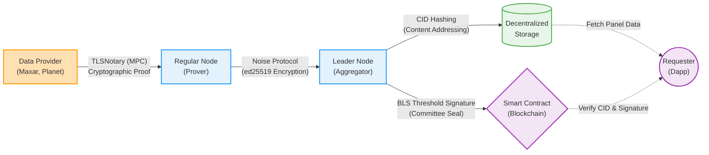

### 1.2 System Actors

Entities in the Iris network participate in one or more of the following roles:

* **Regular Node**: An active committee member that fetches imagery from **Data Providers**, generates TLS provenance proofs, independently verifies leader proposals alongside other nodes, and provides BLS signature shares during final consensus.
* **Leader Node**: A committee member deterministically elected for a specific round to collect manifests, retrieve full imagery payloads via secure Noise streams, run the normalization pipeline, propose the Average Scenario, and aggregate BLS signatures.
* **Relayer**: An off-chain service responsible for bridging communication between the host blockchain and the Iris network. It listens for `DataRequest` events on-chain and broadcasts them to the Iris network, and takes finalized panels to submit them back to the smart contract. **Trust Model & Incentives**: The Relayer is incentivized by a portion of the Requester's fee to cover gas costs. It is completely trustless and cannot forge consensus. Even if a Relayer intercepts the data and computes its own "Average Scenario", it cannot deliver it on-chain because it does not possess the $t$-of-$n$ BLS private key shares required to generate a valid committee threshold signature. It merely transports cryptographically verifiable messages.
* **Data Provider**: External commercial satellite imagery providers (e.g., Maxar, Planet Labs, Sentinel) that supply the raw geospatial data via HTTPS APIs.
* **Requester**: Decentralized applications (dapps) or smart contracts on a host blockchain that request satellite data and consume the finalized, verifiable panels.

### 1.3 Non-Goals & Scope Boundaries

To prevent misinterpretation of the protocol's capabilities, the following are explicitly **out of scope** for the Iris architecture as specified in this document:

* **Real-time or streaming imagery.** Iris operates on a request-response model. Each consensus round produces a single panel for a single point in time. Continuous video feeds or real-time monitoring are not supported — a **Requester** must submit a new `DataRequest` for each observation.
* **Data Provider authentication and access management.** Iris assumes that node operators independently procure API credentials from commercial **Data Providers** (Maxar, Planet, Sentinel, etc.) and configure them in `iris.toml`. The protocol does not broker, subsidize, or manage provider subscriptions.
* **Historical panel serving.** Iris does not maintain a queryable archive of past panels. Once a panel is finalized, its GeoTIFF and metadata are pinned to IPFS and its CID is recorded on-chain. Retrieval of historical data is the **Requester**'s responsibility via IPFS or on-chain lookups.
* **Application-layer data interpretation.** Iris delivers verified, provenance-sealed GeoTIFF imagery. It does not extract semantic information (e.g., crop health indices, building counts, flood extent). Downstream interpretation is delegated to application-specific DONs or off-chain services built on top of Iris.
* **Cross-chain bridge security.** The **Relayer** submits reports to host blockchain smart contracts, but the security of the bridge transport itself (if relaying across chains) is outside Iris's trust boundary.

---

## 2. The Geodesic Reconstruction Model

Before diving into subsystems it helps to have a mental model for *what the state machine is actually building*.

### 2.1 The Analogy: A Sphere of Flat Panels

Imagine the Earth as a geodesic sphere — not a smooth continuous surface, but a polyhedron assembled from many discrete **flat panels** (like a Buckminster Fuller dome projected around the entire globe). Each panel covers a bounded patch of the planet's surface — an **Area of Interest (AoI)** — defined by a bounding box and a point in time.

When a **Requester** requests satellite data for a specific location, the Iris network is essentially being asked to **reconstruct one panel** of this sphere. The reconstruction pipeline works as follows:

1. **Multiple Regular Nodes independently photograph the same panel** by fetching satellite imagery from different **Data Providers** (Maxar, Planet, Sentinel, etc.). Each photograph is a slightly different perspective of the same physical surface — different viewing angles, different spectral sensitivities, different times of day.
2. **The Data Normalization Engine aligns all photographs** into a shared coordinate space via orthorectification, then computes pairwise Similarity Scores ($\mathcal{S}$) to measure how close each photograph is to every other.
3. **The Average Scenario is selected** — the single photograph that is mathematically most similar to the consensus pool. This image becomes the panel's canonical reconstruction: the best available estimate of what that patch of Earth actually looks like.
4. **The panel is finalized** when the committee threshold-signs the reconstruction's IPFS CID and delivers it on-chain.

Over time, as **Requesters** request data for different locations and timestamps, the network accumulates a growing mosaic of verified panels — an ever-expanding geodesic reconstruction of the Earth's surface, each facet independently verified by decentralized consensus.

### 2.2 Why This Analogy Matters

The geodesic model clarifies several architectural decisions:

* **Panels are discrete and bounded.** The state machine does not attempt to reconstruct the entire Earth at once. Each consensus round produces exactly one panel for one AoI at one timestamp. This keeps round complexity constant regardless of network scale.
* **Panels are independently verifiable.** Each panel carries its own CID, its own BLS threshold signature, and its own set of TLS provenance proofs. A consumer can verify a single panel without trusting the rest of the mosaic.
* **Resolution is demand-driven.** The geodesic sphere has no fixed tessellation. Panels are created where **Requesters** request them. A heavily-monitored agricultural region might have hundreds of tightly-packed panels; an open ocean might have none. The "resolution" of the reconstruction is driven entirely by on-chain demand.
* **Temporal layering.** The same AoI can have multiple panels at different timestamps, creating a temporal stack — a time-series of verified reconstructions for the same location.

---

## 3. State Machine Architecture

The Iris state machine operates at **four nested layers**, each tracking different aspects of the system. Understanding these layers is essential to understanding what the node software is actually doing at any given moment.

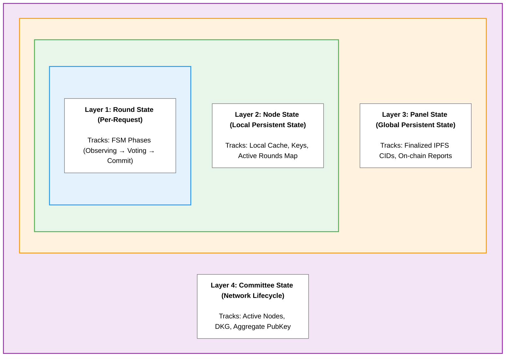

### 3.1 Layer 1 — Round State (per-request lifecycle)

The innermost and most active layer. Every incoming `DataRequest` event from a host blockchain spawns a new **Round**. A round is the atomic unit of work in Iris: it begins with a request and ends with either a finalized panel (success) or a timeout (failure).

The round progresses through a strict finite state machine:

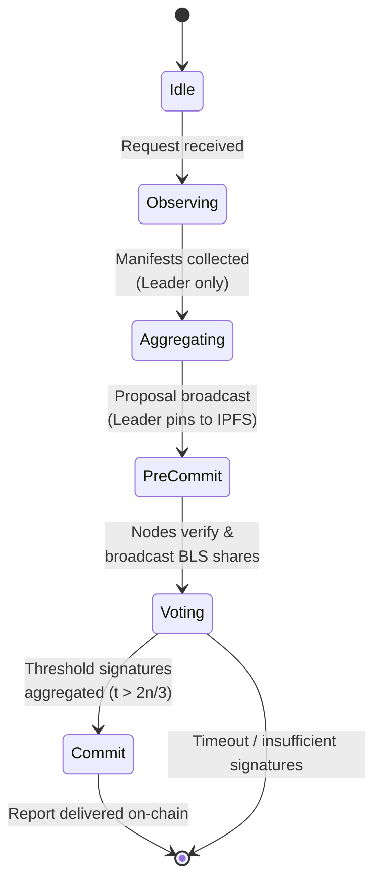

#### State Definitions

| State | Who is active | What is being tracked | Exit condition |
|-------|--------------|----------------------|----------------|
| **Idle** | All nodes | Subscription to `iris/requests/v1`. The node is listening for the next `DataRequest` event from the blockchain **Relayer** (which bridges the on-chain request to the off-chain network) or GossipSub. | A valid `DataRequest` is received and the node determines the **Leader Node** for this round via the election algorithm. |
| **Observing** | All **Regular Nodes** | Each node independently: (1) fetches imagery from its assigned **Data Provider**, (2) generates a TLS provenance proof via TLSNotary, (3) parses the GeoTIFF into a tensor, (4) constructs a lightweight `Manifest` containing `{image_hash, bounding_box, timestamp, tls_proof_hash, node_signature}`, and (5) publishes the manifest to `iris/observations/v1`. The node tracks: which providers it queried, the local file path of the cached GeoTIFF, the `.tlsn` proof path, and its own manifest. | The node has published its manifest AND the observation window timer expires (e.g., 30 seconds). |
| **Aggregating** | **Leader Node** only | The **Leader Node** collects all manifests from `iris/observations/v1`. For each manifest, the **Leader Node** requests the full GeoTIFF payload via a direct libp2p stream (the Bitswap-like transfer protocol). Once all payloads are retrieved, the **Leader Node** runs the full normalization pipeline: orthorectification → similarity metrics ($\mu_1$, $\mu_2$, $\mu_3$) → exponential decay scoring $\mathcal{S}(\mu)$ → pairwise similarity matrix → Average Scenario selection. The **Leader Node** tracks: the similarity matrix, the selected Average Scenario tensor, and its corresponding image hash. | The **Leader Node** has computed the Average Scenario and pinned it to IPFS, obtaining a CID. |
| **Pre-Commit** | **Leader Node** broadcasts, all **Regular Nodes** listen | The **Leader Node** publishes a `Proposal` message to `iris/consensus/v1` containing: `{request_id, selected_image_hash, ipfs_cid, similarity_matrix_summary, leader_signature}`. Each **Regular Node** independently verifies the proposal by: (1) checking the TLS proof for the selected image, (2) fetching the proposed GeoTIFF via libp2p stream, (3) re-running the tensor normalization pipeline locally to confirm the similarity scores, and (4) verifying the IPFS CID matches. The node tracks: verification result (accept/reject), its own partial BLS signature (if accepted). | Each node has either broadcast a BLS signature share to `iris/consensus/v1` (accept) or broadcast a rejection (reject). |
| **Voting** | **Leader Node** collects | The **Leader Node** collects BLS signature shares from `iris/consensus/v1`. It tracks: which nodes have responded, the count of accepts vs. rejects, the partial signatures received. | The **Leader Node** has collected $t$ valid signature shares (where $t > 2n/3$), OR the voting timer expires. |
| **Commit** | **Leader Node** finalizes | The **Leader Node** aggregates $t$ partial BLS signatures into a single 48-byte threshold signature. The **Relayer** module (acting as the trustless transport layer) submits the final report `{request_id, ipfs_cid, aggregated_bls_signature}` to the `IrisVerifier` smart contract on the host blockchain. The round is now finalized. The node tracks: the finalized CID, the aggregated signature, the transaction hash of the on-chain delivery. | The on-chain transaction is confirmed, OR the round is marked as failed (insufficient signatures / timeout). |

#### Round State Data Structure (Conceptual)

```rust
// ── Domain Type Aliases ──────────────────────────────────────────────
// Zero-cost newtypes / aliases that give PeerId, keys, and hashes
// distinct semantic meaning across the codebase.

type LeaderId        = PeerId;            // PeerId of the elected leader for a round
type ContributorId   = PeerId;            // PeerId of a node that contributed an observation
type ContentHash     = Blake2bHash;       // BLAKE2b hash of a raw GeoTIFF payload
type ProofHash       = Blake2bHash;       // BLAKE2b hash of a .tlsn proof file
type AggregateKey    = BlsPublicKey;      // Committee-wide BLS12-381 aggregate public key
type ShareSecretKey  = BlsSecretKeyShare; // A single node's BLS private key share (from DKG)
type SharePublicKey  = BlsPublicKeyShare; // A single node's BLS public key share (from DKG)
type ThresholdSig    = BlsSignature;      // The final aggregated t-of-n BLS signature
```

```rust
struct Round {
    // Identity
    request_id:       RequestId,
    round_number:     u64,
    leader:           LeaderId,
    am_i_leader:      bool,

    // Current position in the FSM
    state:            RoundState,  // enum { Idle, Observing, Aggregating, PreCommit, Voting, Commit }

    // Observation phase
    my_manifest:      Option<Manifest>,
    peer_manifests:   HashMap<ContributorId, Manifest>,
    fetched_tensors:  HashMap<ContentHash, AlignedTensor>,  // Leader only

    // Aggregation phase (Leader only)
    similarity_matrix: Option<Array2<f64>>,
    average_scenario:  Option<AverageScenario>,  // { image_hash, ipfs_cid, tensor }

    // Commit phase
    proposal:          Option<Proposal>,
    signature_shares:  HashMap<ContributorId, BlsSignatureShare>,
    final_signature:   Option<ThresholdSig>,
    verification:      Option<VerificationResult>,  // Regular nodes: did I accept the proposal?

    // Timing
    phase_deadline:    Instant,
}
```

### 3.2 Layer 2 — Node State (persistent, per-node)

This layer persists across rounds. It represents the node's long-lived identity and operational status.

| State field | What it tracks | Mutated when |
|------------|----------------|-------------|
| **Identity** | `ed25519` keypair, derived `PeerId`, BLS private key share | Node first boot (keypair generated) or DKG ceremony (BLS share issued) |
| **Committee Membership** | List of known committee members, their `PeerId`s, stake weights, BLS public key shares, and the aggregate public key | DKG ceremony completes after a committee change |
| **Provider Credentials** | API keys/tokens for **Data Providers** (Maxar, Planet, Sentinel) | Configured by operator in `iris.toml` |
| **Local Cache** | Content-addressed storage for GeoTIFFs (`~/.iris/cache/objects/<blake2b>.tiff`) and TLS proofs (`~/.iris/proofs/<hash>.tlsn`), with operator-friendly symlinks generated per request (`~/.iris/cache/rounds/<request_id>/<provider>_<timestamp>.tiff`) | After every successful fetch |
| **Active Rounds** | Map of `RequestId → Round` for the active round. A node may only participate in a single round at a time to mitigate potential computation and networking bottlenecks | New request arrives / round finalizes |
| **Peer Table** | Kademlia routing table + GossipSub mesh peers | Continuously, via libp2p discovery |

#### Node State Data Structure (Conceptual)

```rust
struct NodeState {
    // Cryptographic identity
    keypair:              ed25519::Keypair,
    local_peer_id:        PeerId,                       // multihash(public_key)
    bls_private_share:    Option<ShareSecretKey>,        // Issued during DKG

    // Committee awareness
    committee_members:    Vec<CommitteeMember>,          // { peer_id, stake_weight, bls_pubkey_share }
    aggregate_pubkey:     Option<AggregateKey>,          // Committee-wide aggregate key
    current_epoch:        u64,                           // Monotonic; increments on committee change

    // Provider credentials (loaded from iris.toml)
    provider_credentials: HashMap<Provider, ApiCredential>,  // e.g., Maxar → Bearer token

    // Local cache (content-addressed storage)
    cache_root:           PathBuf,                       // ~/.iris/cache/
    object_store:         HashMap<ContentHash, PathBuf>, // blake2b → objects/<hash>.tiff
    proof_store:          HashMap<ProofHash, PathBuf>,   // blake2b → proofs/<hash>.tlsn

    // Active round (at most one at a time)
    active_round:         Option<(RequestId, Round)>,

    // Peer table (managed by libp2p)
    kademlia_table:       KademliaRoutingTable,
    gossipsub_mesh:       HashMap<TopicHash, HashSet<PeerId>>,
}

struct CommitteeMember {
    peer_id:          PeerId,
    stake_weight:     u64,
    bls_pubkey_share: SharePublicKey,
}
```

### 3.3 Layer 3 — Panel State (the reconstruction output)

Each finalized round produces a **Panel** — one facet of the geodesic reconstruction. The Panel is the primary logical output of the Iris network. 

```rust
struct Panel {
    // What patch of Earth does this panel represent?
    bounding_box:       BoundingBox,           // Geographic coordinates (lat/lon corners)
    timestamp:          DateTime<Utc>,         // When the imagery was captured

    // The reconstruction
    image_hash:         ContentHash,           // BLAKE2b hash of the finalized image

    // Provenance chain
    tls_proofs:         Vec<TlsProofRef>,      // References to the TLS proofs of contributing nodes
    contributing_nodes: Vec<ContributorId>,    // Which nodes provided imagery for this panel
    similarity_scores:  Vec<f64>,              // Each contributor's similarity score to the Average Scenario

    // Cryptographic seal
    bls_signature:      ThresholdSig,          // Threshold signature from >2/3 of the committee
    aggregate_pubkey:   AggregateKey,          // The committee's aggregate public key at time of signing

    // On-chain anchor
    request_id:         RequestId,             // Links back to the originating smart contract event
}
```

#### Final Payload & Decentralized Storage
While the `Panel` struct exists logically in the memory of the nodes during consensus, the final, long-term payload delivered to **Requesters** is packaged differently to ensure permanent accessibility. 

Once the "Average Scenario" is finalized, the **Leader Node**:
1. Serializes the entire `Panel` data structure into a standardized **`.json` metadata file**.
2. Wraps both the `.json` metadata file and the finalized `.tiff` GeoTIFF image into a single IPFS directory.
3. Pins this directory to IPFS.

The resulting **IPFS CID** now points to the complete package: the visual reconstruction (GeoTIFF) and the mathematically verified history of how it was made (JSON Metadata). The committee signs this root CID, and the Relayer submits it to the smart contract. Dapps can then fetch the IPFS folder to instantly retrieve both the imagery and the trustless provenance data.

Panels are immutable once committed. If the same AoI is requested again at a later time, a new panel is created — it does not overwrite the old one. This creates the **temporal layering** described in the geodesic model.

### 3.4 Layer 4 — Committee State (network-wide, slow-moving)

The committee is the set of staked, authorized nodes that participate in consensus. This state changes infrequently — only when operators join, leave, or are slashed.

| State field | What it tracks | Mutated when |
|------------|----------------|-------------|
| **Active Set** | The ordered list of `(PeerId, stake_weight)` tuples for all nodes currently eligible to participate in rounds | A node stakes/unstakes via the `IrisStaking` smart contract |
| **Aggregate Public Key** | The BLS12-381 aggregate public key representing the committee. Stored both off-chain (in each node's config) and on-chain (in `IrisVerifier.sol`) | DKG ceremony completes after a committee change |
| **Threshold ($t$)** | The minimum number of signature shares required: $t > \lfloor 2n/3 \rfloor$ | Committee size changes |
| **Epoch** | A monotonically increasing counter that increments with each committee change. Ensures stale signatures from old committees cannot be replayed | `updateCommittee()` is called on-chain |

#### Committee State Data Structure (Conceptual)

```rust
struct CommitteeState {
    // Active validator set
    active_set:       Vec<ValidatorEntry>,   // Ordered by cumulative stake
    total_stake:      u64,                   // Sum of all stake weights

    // Threshold cryptography
    aggregate_pubkey: AggregateKey,          // BLS12-381 aggregate public key
    threshold:        usize,                 // t > floor(2n/3) required signature shares
    dkg_state:        DkgState,              // Idle | InProgress | Completed

    // Epoch tracking
    epoch:            u64,                   // Monotonic; increments on committee change
    last_dkg_block:   u64,                   // Block height of last successful DKG
}

struct ValidatorEntry {
    peer_id:          PeerId,
    stake_weight:     u64,
    bls_pubkey_share: SharePublicKey,
    cumulative_stake: u64,  // Used for leader election range mapping
    status:           ValidatorStatus,       // PendingJoin | Active | SlashedExited
}

enum DkgState {
    Idle,
    InProgress { participants: Vec<PeerId>, round: u32 },
    Completed { shares_dealt: usize },
}
```

#### Committee Lifecycle

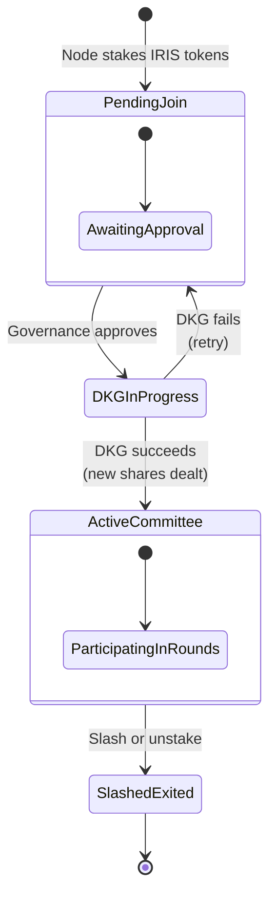

---

## 4. Network Layer

Iris is built on its own peer-to-peer (P2P) networking stack to remove dependencies on external oracle infrastructures. The network layer is responsible for peer discovery, authenticated communication, message propagation, and large-payload transfer between nodes. Understanding how these sub-layers compose is essential to understanding how consensus messages, manifests, and imagery flow through the system.

### 4.1 Protocol Stack

Iris is built entirely on `rust-libp2p` and composes several protocol behaviours into a single multiplexed connection between any two peers. The layering looks like this:

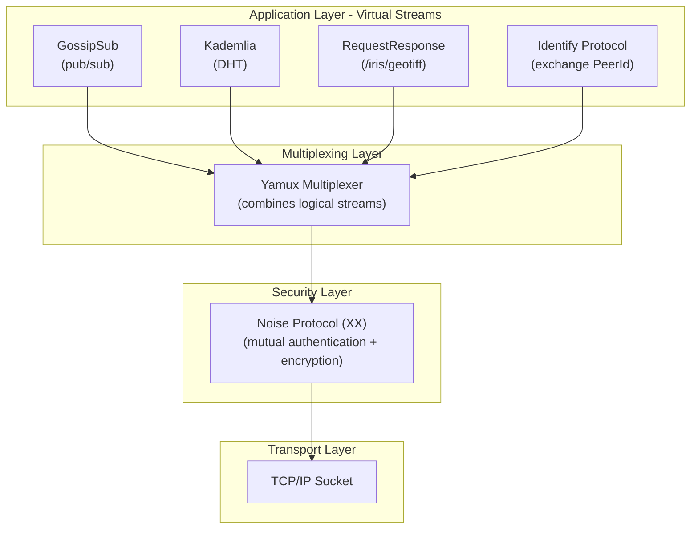

Every connection between two Iris nodes traverses this entire stack. A single TCP connection is upgraded through Noise, multiplexed through Yamux, and then hosts multiple concurrent protocol streams — a Kademlia lookup, a GossipSub mesh link, and a GeoTIFF transfer can all share the same underlying socket.

### 4.2 Transport & Security

| Layer | Technology | Purpose |
|-------|-----------|---------|
| **Transport** | TCP/IP with DNS resolution | Reliable, ordered byte-stream transport. DNS allows nodes to advertise human-readable addresses (`/dns4/bootnode.iris.network/tcp/9000`) alongside raw IPs |
| **Multiplexing** | Yamux | Stream multiplexer that enables multiple logical streams over a single TCP connection. Each protocol (Kademlia, GossipSub, RequestResponse, Identify) opens its own Yamux sub-stream without requiring a new TCP handshake |
| **Encryption** | Noise Protocol Framework (XX handshake) | Every connection is encrypted and mutually authenticated. During the handshake, both peers prove possession of their `ed25519` private keys. The resulting Noise session provides forward-secure symmetric encryption for all data on the wire |
| **Identity** | ed25519 keypairs → `PeerId` | A node's `PeerId` is the multihash of its ed25519 public key. This creates a one-to-one binding between network identity and cryptographic identity — there is no way to impersonate a `PeerId` without holding the corresponding private key |

#### 4.2.1 Cryptographic Node Identity (`PeerId`)

In a decentralized network, it is critical to definitively prove *who* is sending a message without relying on a centralized registry. Iris solves this natively at the network layer using `ed25519` keypairs to generate a mathematically verifiable `PeerId`.

**How the `PeerId` is Created & Secured:**
1. **Key Generation**: When an Iris node is booted for the very first time, it generates a fresh `ed25519` cryptographic keypair. It stores the private key securely on the local disk.
2. **Derivation**: The node runs its public key through a multihash function. The resulting hash string (e.g., `12D3KooW...`) is the node's `PeerId`. Because it is derived from the public key, the `PeerId` is permanently and exclusively mathematically bound to the private key.
3. **The Noise Handshake**: Whenever two Iris nodes connect, they perform a Noise Protocol handshake. During this handshake, the connecting node must use its private key to sign a cryptographic challenge. The receiving node verifies the signature against the public key matching the `PeerId`.

**Why This Matters for Iris:**
This identity binding makes impersonation impossible. When a node receives a BLS signature share or a TLS proof from `PeerId X`, the underlying Noise connection has already cryptographically proven that the sender actively holds the private key for `X`. No additional authentication checks are needed at the application layer. 

Similarly, TLS provenance proofs are bound to the signing node's `PeerId`, creating an unbroken chain: **satellite API → TLS proof → node identity → BLS signature share → on-chain verification**.

#### 4.2.2 Node-to-Node Communication Lifecycle

To understand exactly how the Noise protocol and other network layers are used in practice, here is the chronological setup process every time two Iris nodes communicate (e.g., when the Leader connects to a Regular Node to fetch a GeoTIFF):

1. **The TCP Connection:** Node A initiates a standard TCP connection to Node B's IP address and port. At this stage, the connection is raw, unencrypted, and unauthenticated.
2. **The Noise Handshake (Security):** Immediately after the TCP connection is open, the nodes execute the **Noise Protocol (XX pattern)**. 
   * They perform a Diffie-Hellman key exchange to generate a temporary "shared secret" key.
   * They mutually authenticate by signing a challenge with their long-term `ed25519` private keys.
   * *Result:* The connection is now mutually authenticated and protected by forward-secure encryption. If a hacker intercepts the traffic, it appears as random noise.
3. **The Yamux Multiplexer:** With the secure tunnel established, the nodes initialize Yamux. Instead of opening a new TCP connection for every file transfer or gossip message, Yamux allows the nodes to open hundreds of lightweight, concurrent "virtual streams" inside that single encrypted Noise tunnel.
4. **The Identify Protocol:** The very first virtual stream opened is the `Identify` protocol. The nodes formally introduce themselves by exchanging their `PeerId`, their software version (`iris-node/v1.0.0`), and the specific sub-protocols they support.
5. **Application Streams:** Once identified, the nodes open further virtual streams for actual Iris protocol work. They will open a long-running stream for `GossipSub` (to exchange lightweight manifests) and temporary `RequestResponse` streams to directly transfer massive GeoTIFF payloads (~1GB up to 16GB).
Because Noise secures the *entire* TCP connection at the lowest level, all subsequent Yamux streams, GossipSub messages, and GeoTIFF transfers are automatically encrypted and inherently trusted to be coming from that specific `PeerId`.

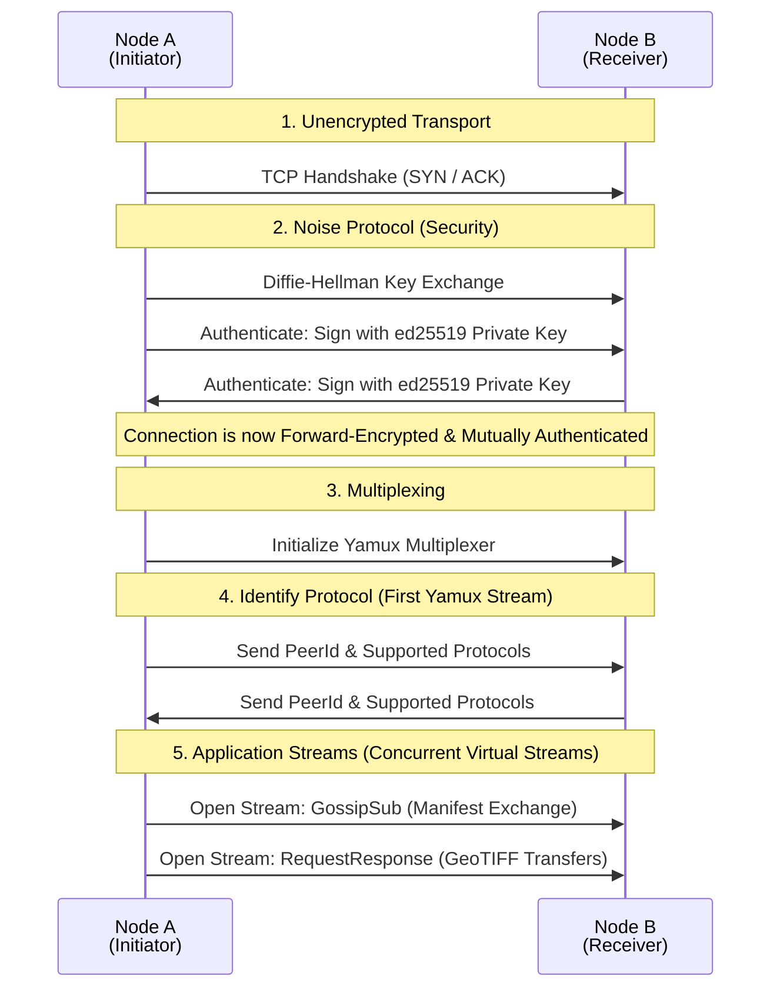
### 4.3 Peer Discovery (Kademlia DHT)

Iris uses a Kademlia Distributed Hash Table for decentralized peer discovery. The Kademlia DHT does not store application data — it is used exclusively for finding other Iris nodes.

#### 4.3.1 Bootstrap Process

When a new node starts for the first time:

1. **Load bootstrap addresses.** The node reads a list of well-known bootstrap `Multiaddr` values from `iris.toml`. These are hosted by the Iris Foundation initially and are the only hardcoded entry points into the network.
2. **Dial bootstraps.** The node establishes TCP connections to each bootstrap peer, performs the Noise handshake, and runs the Identify protocol to exchange agent strings, listen addresses, and protocol versions.
3. **Kademlia bootstrap.** The node issues a Kademlia `FIND_NODE` query for its own `PeerId`. This self-lookup populates its routing table by discovering nodes that are close in XOR distance.
4. **Random walks.** Periodically (every 30 seconds), the node queries a random `PeerId` to further populate its routing table and maintain diverse connections across the keyspace.
5. **Steady state.** Once the routing table contains enough peers, the node can discover any other node in $O(\log n)$ hops without relying on the bootstrap nodes.

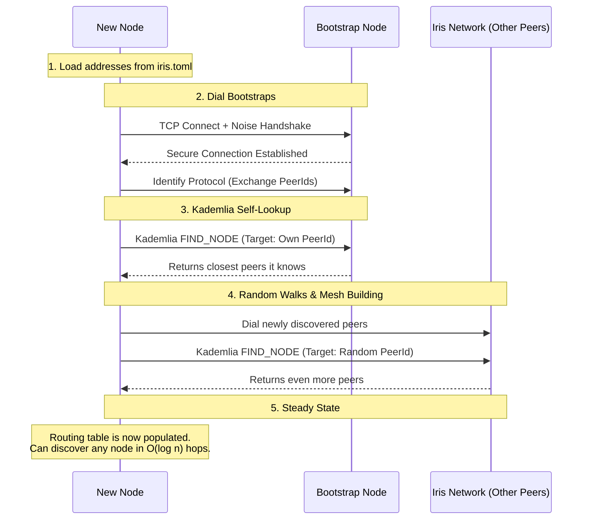

#### 4.3.2 Routing Table

The Kademlia routing table organizes peers into **k-buckets** by XOR distance from the local node's `PeerId`. Each bucket holds up to $k = 20$ peers. The table provides $O(\log n)$ lookup guarantees for a network of $n$ nodes. For Iris's expected committee sizes (10–100 nodes), this means any node can be located in 1–2 hops.

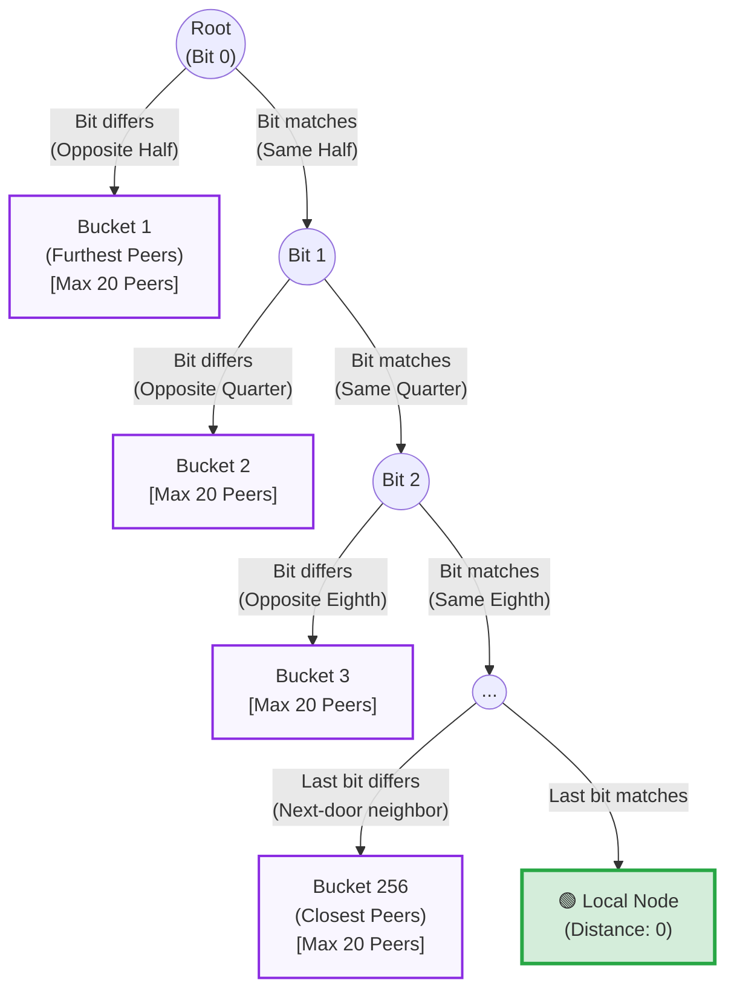

### 4.4 Message Propagation (GossipSub v1.1)

GossipSub is the pub/sub layer that propagates lightweight messages across the network. Iris uses GossipSub v1.1, which includes peer scoring and flood publishing to harden the mesh against Sybil and eclipse attacks.

#### Topic Architecture

Iris defines three GossipSub topics, each carrying a specific message type at a specific phase of the round:

| Topic | Message Type | Payload Size | Published By | Consumed By | Round Phase |
|-------|-------------|-------------|-------------|-------------|-------------|
| `iris/requests/v1` | `DataRequest` | ~200 bytes | Relayer (one node) | All nodes | `Idle → Observing` |
| `iris/observations/v1` | `Manifest` | ~500 bytes | All **Regular Nodes** | **Leader Node** | `Observing` |
| `iris/consensus/v1` | `Proposal` / `BLSShare` / `Rejection` | ~300–800 bytes | **Leader Node** (Proposal) / **Regular Nodes** (BLSShare) | All nodes | `PreCommit → Voting → Commit` |

> **Critical design decision:** Full GeoTIFF payloads (500 MB – 16 GB each) are **never** published to GossipSub. Gossiping a 1 GB file to a 20-node mesh would produce ~20 GB of total network traffic per observation per node. Instead, only lightweight manifests (~500 bytes) are gossiped. The **Leader Node** retrieves full payloads via direct streams (Section 4.5) only when needed.

#### Mesh Topology

GossipSub v1.1 maintains a mesh of $D = 6$ peers per topic (configurable via `iris.toml`). The mesh parameters are:

| Parameter | Value | Rationale |
|-----------|-------|-----------|
| $D$ (target mesh degree) | 6 | Balances redundancy against bandwidth. Each message is forwarded to 6 peers |
| $D_{low}$ (minimum mesh degree) | 4 | Below this, the node GRAFTs additional peers into the mesh |
| $D_{high}$ (maximum mesh degree) | 12 | Above this, the node PRUNEs excess peers to limit fan-out |
| $D_{lazy}$ (gossip factor) | 6 | Number of peers to whom the node sends `IHAVE` control messages for messages not directly forwarded |
| Heartbeat interval | 1 second | How often the node evaluates mesh health and peer scores |
| Message TTL | 120 seconds | Messages older than this are dropped and not forwarded |

#### Peer Scoring

GossipSub v1.1's peer scoring system is essential for Iris's Byzantine resistance at the network layer. Each peer is assigned a score based on:

* **Message delivery rate** — Peers that consistently deliver valid, timely messages score higher. Peers that flood invalid messages are penalized.
* **Mesh participation** — Peers that maintain stable mesh connections without excessive GRAFT/PRUNE churn are rewarded.
* **IP colocation penalty** — Multiple peers sharing the same IP range receive a penalty, reducing the effectiveness of Sybil attacks from a single data center.
* **Application-specific scoring** — Iris can inject custom scoring logic: for example, penalizing peers that publish manifests with invalid signatures or TLS proof hashes that fail verification.

Peers whose score drops below a configurable threshold are disconnected from the mesh and eventually blacklisted from the topic entirely.

#### Message Serialization

All GossipSub messages are serialized using **serde-cbor** (Concise Binary Object Representation). CBOR was chosen over Protobuf for the MVP because:

* It is schema-free, simplifying rapid iteration during development.
* It is self-describing, making debugging easier.
* The `serde` ecosystem in Rust provides zero-cost serialization with `#[derive(Serialize, Deserialize)]`.

A migration to Protobuf (with schema enforcement) is an open decision for post-testnet hardening.

### 4.5 Direct Streams — GeoTIFF Transfer Protocol

GossipSub is designed for small, fan-out messages. Satellite imagery is neither small nor fan-out — the **Leader Node** needs to pull specific GeoTIFFs from specific peers. Iris uses a custom `RequestResponse` protocol for this purpose.

#### Protocol Definition

| Field | Value |
|-------|-------|
| Protocol ID | `/iris/geotiff/1.0.0` |
| Transport | libp2p `RequestResponse` behaviour over the existing Yamux-multiplexed connection |
| Request payload | `GeotiffRequest { image_hash: ImageHash }` — the BLAKE2b hash of the desired GeoTIFF, as advertised in the sender's manifest |
| Response payload | `GeotiffResponse { data: Vec<u8> }` — the raw GeoTIFF bytes, streamed in chunks |
| Timeout | 3600 seconds |
| Max payload size | 16 GB |

#### Transfer Flow


The **Leader Node** opens parallel direct streams to all contributing nodes simultaneously (via `tokio` tasks). Each stream is a dedicated Yamux sub-stream — they do not interfere with each other or with GossipSub traffic on the same connection.

#### Integrity Verification

Upon receiving a GeoTIFF payload, the **Leader Node**:

1. Computes `BLAKE2b(payload)` and verifies it matches the `image_hash` from the sender's manifest.
2. Checks that the manifest's `tls_proof_hash` references a valid, verifiable TLS proof (either cached locally or fetched from the sender via a separate request).
3. Stores the raw GeoTIFF payload in the local cache (`~/.iris/cache/objects/<blake2b>.tiff`) and parses it into an in-memory `ndarray`-based tensor representation for the normalization pipeline.

If any verification step fails, the payload is discarded and the contributing node's peer score is penalized.

### 4.6 Message Lifecycle — A Complete Round

To illustrate how all network sub-layers interact during a single consensus round:

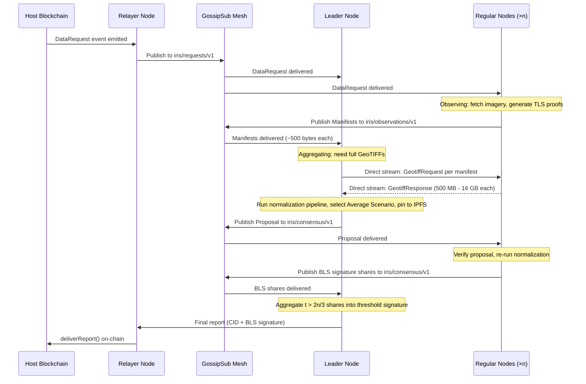

Notice the two distinct bandwidth regimes:

* **GossipSub traffic** (lightweight, fan-out): `DataRequest` (~200 B) → `Manifest` (~500 B × n) → `Proposal` (~800 B) → `BLSShare` (~300 B × n). For a 20-node committee, total GossipSub traffic per round is under **50 KB**.
* **Direct stream traffic** (heavy, point-to-point): The **Leader Node** pulls ~1 GB × n GeoTIFFs. For a 20-node committee, this is ~**20 GB** — but it flows only to the **Leader Node**, not to every peer. During PreCommit verification, **Regular Nodes** may also pull the proposed GeoTIFF (~1 GB each) via direct stream from the **Leader Node**.

This two-tier design keeps the GossipSub mesh fast and lightweight while allowing the **Leader Node** to handle bulk data transfer via dedicated point-to-point channels.

### 4.7 Network State Data Structure (Conceptual)

The network layer maintains its own persistent state that lives alongside the Node State (Section 3.2):

```rust
struct NetworkState {
    // Identity & transport
    local_peer_id:    PeerId,
    keypair:          ed25519::Keypair,
    listen_addresses: Vec<Multiaddr>,       // e.g., /ip4/0.0.0.0/tcp/9000

    // Discovery
    bootstrap_addrs:  Vec<Multiaddr>,       // From iris.toml
    kademlia_table:   KademliaRoutingTable, // k-buckets of known peers
    connected_peers:  HashSet<PeerId>,      // Currently connected peers

    // GossipSub mesh state (per topic)
    mesh: HashMap<TopicHash, MeshState>,
    peer_scores: HashMap<PeerId, f64>,      // GossipSub v1.1 peer scores

    // Direct streams
    pending_transfers: HashMap<RequestId, Vec<PendingGeotiffRequest>>,
    transfer_stats:    HashMap<PeerId, TransferMetrics>,  // bandwidth, latency
}

struct MeshState {
    topic:       TopicHash,
    mesh_peers:  HashSet<PeerId>,   // Active mesh links (target: D=6)
    fanout_peers: HashSet<PeerId>,  // Peers we publish to but aren't meshed with
    last_published: Instant,
}

struct TransferMetrics {
    bytes_sent:     u64,
    bytes_received: u64,
    avg_latency_ms: f64,
    failed_requests: u32,
}
```

### 4.8 Configuration (`iris.toml` — Network Section)

All network parameters are operator-configurable via the `[network]` section of `iris.toml`:

```toml
[network]
listen_address = "/ip4/0.0.0.0/tcp/9000"
bootstrap_peers = [
    "/dns4/boot1.iris.network/tcp/9000/p2p/12D3KooW...",
    "/dns4/boot2.iris.network/tcp/9000/p2p/12D3KooW...",
    "/dns4/boot3.iris.network/tcp/9000/p2p/12D3KooW...",
]

[network.gossipsub]
mesh_degree = 6
mesh_degree_low = 4
mesh_degree_high = 12
lazy_degree = 6
heartbeat_interval_ms = 1000
message_ttl_seconds = 120

[network.kademlia]
k_bucket_size = 20
bootstrap_interval_seconds = 30

[network.transfer]
geotiff_timeout_seconds = 3600
max_payload_bytes = 17_179_869_184  # 16 GB
max_concurrent_transfers = 10
```

---

## 5. Data Provenance & Ingestion

This section is a focused deep-dive into the cryptographic mechanism that secures the first link in the Chain of Provenance: proving that raw satellite imagery is genuine and untampered. For the full round lifecycle that *uses* these proofs (observation, aggregation, verification, signing), see [§3.1 — Round State](#31-layer-1--round-state-per-request-lifecycle). For the normalization pipeline that processes verified raw data, see [§6 — Data Normalization Engine](#6-data-normalization-engine-the-reconstruction-pipeline).

### 5.1 The Provenance Problem

Iris operates under the assumption that individual **Regular Nodes** are untrusted. If a node were to simply download a GeoTIFF and submit it, nothing would prevent that node from modifying the image (e.g., removing a building or altering crop health indicators). Furthermore, the data requires heavy preprocessing (orthorectification, resampling) before the network can compare it — and the network cannot trust the node to perform that preprocessing honestly.

Iris solves this with an unbroken **Chain of Provenance** built on two mechanisms:

1. **Cryptographic Proofs** (this section): TLSNotary MPC proofs guarantee the raw data's origin.
2. **Deterministic Reproduction** (§6, §7.4): Verifiers independently re-run the normalization pipeline on the proven raw data, ensuring any tampering during preprocessing is detected.

The result is a verifiable chain: **Satellite API → TLS proof (Raw Data) → Deterministic Normalization → BLS Signature → On-chain Verification**.

### 5.2 TLSNotary: MPC-Based Proof of Origin

Iris leverages **TLSNotary** — a Multi-Party Computation (MPC) protocol built on top of standard TLS — to create a cryptographic guarantee of the raw data's origin without requiring cooperation from the **Data Provider**.

#### The MPC Session

When a **Regular Node** queries a **Data Provider**'s API during the `Observing` phase (see §3.1), it does not simply open a normal TLS connection. Instead:

1. **Prover & Notary Roles**: The node acts as the **Prover** in a 2-party MPC protocol. A separate **Notary** server participates as the second party. Together, they jointly execute the TLS handshake and session without either party holding the complete TLS session keys.
2. **Garbled Circuit Execution**: The TLS key exchange is computed via an oblivious transfer / garbled circuit protocol. The Prover holds its share of the pre-master secret; the Notary holds the other share. Neither party can decrypt the TLS traffic alone — both shares are required.
3. **Session Execution**: The node connects to the authenticated endpoint (e.g., `api.maxar.com`), performs the TLS handshake using the MPC-derived keys, and downloads the satellite imagery payload. The Notary sees the *encrypted* traffic but cannot read the plaintext.
4. **Selective Disclosure**: After the session completes, the Prover can selectively reveal portions of the transcript to the Notary for signing, while redacting sensitive fields (e.g., API keys in request headers). The Notary signs a commitment over the revealed portions.

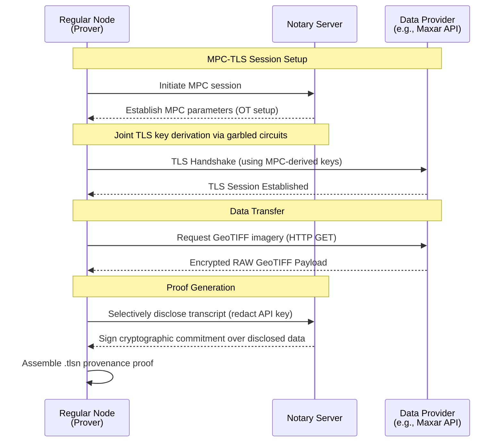

### 5.3 Anatomy of a `.tlsn` Proof

The `.tlsn` proof file is the artifact that a **Regular Node** produces after a successful TLSNotary session. It is a self-contained, portable proof that any third party can verify without contacting the original **Data Provider** or the **Notary**. The proof contains:

| Field | Description |
|-------|-------------|
| **Server Identity** | The DNS hostname and TLS certificate chain of the **Data Provider** (e.g., `api.maxar.com`). Proves the connection was made to the authentic API endpoint, not a spoofed server |
| **Session Parameters** | The TLS version, cipher suite, and session ID. Anchors the proof to a specific cryptographic session |
| **Request Transcript** | The HTTP request sent by the node (with sensitive fields like `Authorization` headers redacted via selective disclosure). Proves *what* was requested (coordinates, timestamp, imagery product) |
| **Response Transcript** | The HTTP response body — the raw GeoTIFF payload. This is the critical field: it contains the exact bytes the API returned |
| **Response Hash** | A `BLAKE2b` hash of the raw response payload. This hash is what appears in the node's `Manifest` as `tls_proof_hash`, linking the GossipSub message to the proof |
| **Notary Signature** | The Notary's cryptographic signature over the committed transcript. This is the root of trust — it attests that the Notary co-participated in the MPC-TLS session and witnessed the disclosed portions |
| **Notary Public Key** | The public key of the Notary that produced the signature, enabling verification without contacting the Notary |
| **Timestamp** | The wall-clock time of the session, signed by the Notary |

> **Key Property:** The `.tlsn` proof only covers the **raw, unprocessed** API response. It does not — and cannot — attest to any post-processing the node performs on the data. This is why Iris requires Deterministic Reproduction (§6, §7.4) as the second link in the provenance chain.

### 5.4 Proof Verification

Any node in the network can verify a `.tlsn` proof by performing the following steps. This verification is executed by the **Leader Node** during the `Aggregating` phase and by **Regular Nodes** during the `PreCommit` phase (see §3.1 for phase definitions).

1. **Certificate Chain Validation**: Verify the TLS certificate chain in the proof against the system's trusted CA root store. Confirm the server's hostname matches an approved **Data Provider** (e.g., `api.maxar.com`, `api.planet.com`). This prevents proofs forged against rogue servers.
2. **Notary Signature Verification**: Verify the Notary's signature over the committed transcript using the embedded Notary public key. The Notary public key must belong to a set of approved Notaries (see §5.5).
3. **Payload Integrity Check**: Compute `BLAKE2b(response_payload)` from the proof's response transcript and verify it matches the `image_hash` advertised in the node's `Manifest`. This binds the GossipSub attestation to the proven raw data.
4. **Request Plausibility Check**: Inspect the (selectively disclosed) request transcript to confirm the query parameters match the active `DataRequest` — i.e., the bounding box and timestamp in the HTTP request are consistent with the AoI being reconstructed.
5. **Timestamp Freshness**: Verify the Notary-signed timestamp falls within an acceptable window relative to the `DataRequest` event's block timestamp. This prevents replay of stale proofs from previous rounds.

If any step fails, the proof is rejected, the associated payload is discarded, and the contributing node's GossipSub peer score is penalized (see §4.4 — Peer Scoring).

### 5.5 Trust Assumptions & the Notary

The Notary server is the root of trust in the TLSNotary protocol. Understanding its trust boundary is critical for evaluating Iris's security guarantees.

#### What the Notary *can* do

* **Attest to session authenticity**: The Notary co-participated in the TLS key derivation and can sign a commitment certifying that the transcript is genuine.
* **Deny service**: A malicious or offline Notary can refuse to participate, preventing the Prover from generating a proof. This is a **liveness** concern, not a safety concern — it causes the node to fail its observation, not to produce a forged proof.

#### What the Notary *cannot* do

* **Read the plaintext**: Because the TLS keys are split via MPC, the Notary only sees encrypted traffic (unless the Prover selectively discloses portions). The Notary cannot access the raw GeoTIFF data or API credentials.
* **Forge a proof alone**: The Notary's signature is over a transcript that requires the Prover's participation to construct. A Notary cannot unilaterally create a valid proof for a session that never occurred.

#### What the Notary *could* do if colluding with the Prover

* **Co-sign a fabricated transcript**: If both the Prover and the Notary collude, they could jointly construct a `.tlsn` proof for a session that never happened (or that connected to a different server). This is the fundamental trust assumption of TLSNotary.

#### Iris's Mitigation Strategy

| Approach | Status | Description |
|----------|--------|-------------|
| **Approved Notary Set** | MVP | The network maintains a whitelist of approved Notary public keys. Proofs signed by unknown Notaries are rejected. Initially, the Iris Foundation operates the approved Notaries |
| **Notary Diversity Requirement** | Planned | Require that nodes in the same round use *different* Notary servers, preventing a single compromised Notary from affecting all observations |
| **Decentralized Notary Pool** | Future | Transition to a permissionless pool of staked Notary operators. Notaries that co-sign fabricated proofs (detected via cross-referencing with other providers' data for the same AoI) are slashed |
| **Multi-Notary MPC** | Research | Extend the 2-party MPC to a $k$-of-$m$ threshold MPC, where multiple independent Notaries must jointly attest to a session. This eliminates single-Notary collusion entirely |

> **Bottom Line:** In the MVP, the Notary is a semi-trusted centralized service operated by the Iris Foundation. This is an acceptable bootstrapping compromise because: (a) the Notary cannot read the data, (b) the Notary cannot forge proofs alone, and (c) even if the Notary colludes with one Prover, the BFT threshold ($t > 2n/3$) ensures that a single forged observation cannot swing consensus. The roadmap progressively decentralizes the Notary role.

---

## 6. Data Normalization Engine (The Reconstruction Pipeline)

Images received from different satellite constellations possess varying spectral bands, resolutions, and perspectives. Before the network can compare these images — before it can reconstruct a panel — they undergo a rigorous normalization pipeline implemented natively in Rust.

### 6.1 Orthorectification

Raw 2D imagery is projected onto a shared 3D Digital Elevation Model (DEM) sourced from SRTM tiles. This corrects for the satellite's viewing angle and the Earth's curvature, aligning all pixels into a unified target space $\mathbb{R}^{a \times N \times M}$. The result: disparate images from different satellites now occupy the same coordinate grid and can be compared element-wise.

### 6.2 Similarity Metrics

The network computes three independent metrics on aligned tensor pairs ($\bar{A}$, $\bar{B}$):

* **Mean Absolute Distance ($\mu_1$)**: Linear penalty for total absolute spatial deviation across all bands and pixels.
* **Mean Squared Error ($\mu_2$)**: Quadratic penalty that heavily punishes localized, extreme anomalies (e.g., malicious pixel manipulation) while being forgiving of uniform noise.
* **Spectral Angle Mapper ($\mu_3$)**: The N-dimensional angle between pixel vectors. Isolates changes in actual physical materials (spectral signature) while being completely blind to changes in illumination or shadow intensity.

### 6.3 Similarity Scoring

The three metrics are combined into a single Similarity Score via a physics-based exponential decay function:

$$\mathcal{S}(\mu) = 100 \cdot e^{-(\beta_1 \mu_1 + \beta_2 \mu_2 + \beta_3 \mu_3)}$$

The $\beta$ tuning vector controls how aggressively each type of error destroys the similarity score. Defaults are defined in config and empirically tuned during testnet.

### 6.4 Average Scenario (Medoid) Selection

Given $n$ observations from $n$ nodes, the **Leader Node** computes all $\binom{n}{2}$ pairwise Similarity Scores and builds a similarity matrix. Rather than mathematically averaging the pixels to create a synthetic composite image (which would destroy the cryptographic Chain of Provenance), the Leader uses the matrix to find the **Medoid** — it selects the single, existing image with the highest mean similarity to all others.

This selected image — termed the **Average Scenario** — becomes the panel's canonical reconstruction. Because the Average Scenario is an original, unaltered payload fetched by one of the nodes, it inherently retains its original TLS proof, allowing the rest of the network to verify its authenticity.

> **Note:** For the complete mathematical formulation and definitions of the tensors used in this pipeline, refer to the [Data Normalization Specification](./data_normalization.md).

---

## 7. Consensus Engine (Iris-BFT)

The Iris-BFT consensus drives the Round State Machine (Section 3.1). Its role is to coordinate the network through the observation, aggregation, and signing phases for each panel reconstruction.

### 7.1 Leader Election

A deterministic, stake-weighted round-robin algorithm selects the Leader for each round:

```
leader_index = hash(block_hash ‖ request_id) % total_stake
```

The index is mapped to the node whose cumulative stake range covers that value. Because the inputs (block hash, request ID) are publicly known, every node independently computes the same Leader without extra communication.

> **Why Stake-Weighted is Safe Here:** While a node with more stake will be elected Leader more frequently, the Leader possesses **zero subjective power**. The Leader cannot "smudge" the results or provide a sub-optimal average because the normalization pipeline and Average Scenario selection are 100% deterministic (see Section 6.4). If a wealthy Leader attempts to propose an image that isn't the exact mathematical winner, the Regular Nodes will compute the discrepancy during their independent verification and reject the proposal. The Leader is merely a designated worker to handle the IPFS pinning and proposal broadcasting, not a dictator of the truth.

### 7.2 Observation Window

After a request arrives, nodes have a configurable window (default: 30 seconds) to fetch imagery, generate TLS proofs, and publish their manifests. Manifests are lightweight — they contain only the image hash, bounding box, TLS proof hash, and node signature. Full GeoTIFFs are never gossiped.

### 7.3 Aggregation & Proposal

The **Leader Node** collects manifests, retrieves full GeoTIFFs via direct streams, runs the normalization pipeline, selects the Average Scenario, pins it to IPFS, and broadcasts a `Proposal` containing the CID and similarity evidence.

### 7.4 Verification & Signing

To avoid $O(n^2)$ network bandwidth and $O(n^3)$ global compute (which would happen if every node downloaded every other node's 16GB GeoTIFF to verify the entire matrix), verification is highly optimized:

**Regular Nodes** independently verify the proposal by fetching *only* the proposed image via direct stream. They re-run the normalization pipeline to compare the proposed image strictly against their own local image ($O(1)$ comparison per node). If the proposed image has a valid TLS proof, and the similarity score matches the Leader's claim and is above the network's acceptance threshold, they broadcast a BLS partial signature. 

*(Note: Because nodes only verify their own "edge" of the similarity graph, the Leader could theoretically propose a sub-optimal image as long as it still passes the threshold for $> 2n/3$ nodes. However, because the proposed image must possess a valid TLS proof, the Leader is restricted to choosing among genuine, API-verified images, preventing malicious forgery.)*

The **Leader Node** collects $t > \lfloor 2n/3 \rfloor$ shares and aggregates them into a single threshold signature.

### 7.5 Threshold Cryptography

* **Curve**: BLS12-381.
* **Key Generation**: Distributed Key Generation (DKG) via Feldman's VSS is run only during committee changes — not per-request. The ceremony produces one aggregate public key and $n$ private key shares.
* **Aggregation**: $t$-of-$n$ partial signatures combine into a single 48-byte BLS signature that is verifiable by anyone holding the aggregate public key.

---

## 8. Smart Contract Integration

While the heavy computation (fetching, TLS proof generation, tensor comparisons) happens off-chain, the final results must be verifiable on-chain for dapps to consume.

* **Iris Verifier Contract**: Deployed on target host chains (e.g., Ethereum, Polygon), this contract is seeded with the network's aggregate public key and the current epoch counter.
* **Report Delivery**: The Relayer module submits `deliverReport(requestId, ipfsCid, signature)`. The contract recreates the message digest from `requestId` and `ipfsCid`, then verifies the BLS signature against the stored aggregate public key via precompile (EIP-2537) or a Solidity BLS library.
* **Tokenomics (Staking & Slashing)**: Node operators must stake IRIS tokens to join the active committee. **Requesters** pay request fees that are distributed to honest nodes (those whose similarity scores exceeded the threshold). Nodes providing anomalous data or invalid TLS proofs have their stakes slashed. A portion of the request fee is also allocated to the **Relayer** to cover the gas costs of submitting the on-chain transaction, plus a profit margin to incentivize reliable relaying.
* **Requester Callback**: Upon successful verification, the contract calls `targetContract.onIrisDataReceived(requestId, ipfsCid)` via the `IIrisReceiver` interface, injecting the verified panel into the **Requester**'s ecosystem.
* **Data Distillation**: External networks (like Chainlink DONs) can query the Iris API Gateway to ingest verified GIS data and distill it into simpler numerical attributes for smart contracts.

---

## 9. How the Layers Connect — A Full Request Walkthrough

> **Note:** This walkthrough intentionally revisits the state transitions from §3.1 and the provenance chain from §5. It is designed as a consolidated reference summary that traces a single request through all four state layers end-to-end.

To tie everything together, here is a single request traced through all four state layers:

1. **Committee State** is already established: 7 staked nodes have completed DKG, the aggregate public key is registered on-chain, $t = 5$.
2. A **Requester** emits a `DataRequest` event on Ethereum. The **Relayer** picks it up and publishes it to `iris/requests/v1`.
3. Each node's **Node State** spawns a new **Round** (Layer 1). The round enters `Idle → Observing`.
4. In `Observing`, each node fetches imagery, generates a TLS proof, and publishes a manifest. The **Node State** caches the GeoTIFF locally.
5. The elected **Leader Node**'s round transitions to `Aggregating`. The **Leader Node** retrieves all GeoTIFFs, runs the normalization pipeline, selects the Average Scenario, and pins it to IPFS.
6. The **Leader Node**'s round transitions to `Pre-Commit` and broadcasts the proposal.
7. **Regular Nodes** verify and transition to `Voting`, broadcasting their BLS signature shares.
8. The **Leader Node** collects 5 shares, aggregates them, and transitions to `Commit`.
9. The Relayer submits the report on-chain. The **Panel** (Layer 3) is now finalized — one more facet of the geodesic sphere.
10. **Committee State** is unchanged (no nodes joined or left this round). The round is cleaned up from each node's **Node State**.

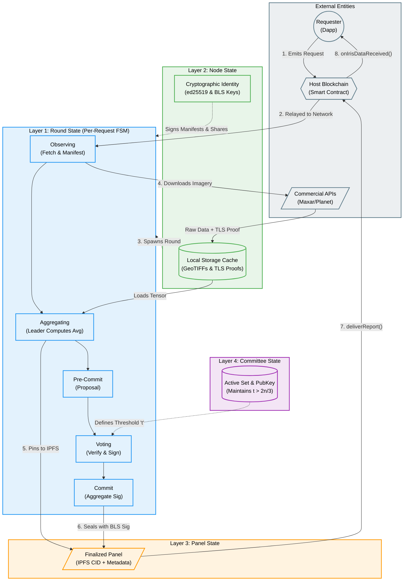

---

## 10. System Complexity and Compute Requirements

Given the strict demands of the Iris Protocol to ingest and process satellite imagery at a nation-state resistant level, nodes require high-end prosumer hardware. Below are the estimated complexity and resource requirements for a single consensus round.

### 10.1 Cryptographic Compute (Hashing)
The Iris Protocol natively uses **BLAKE2b** as its core hashing algorithm. When processing payloads up to 16 GB, cryptographic speed and nation-state resistance are equally critical. BLAKE2b was chosen over SHA-256 and SHA-512 because it provides 512-bit post-quantum security (unlike SHA-256's 128-bit quantum resistance), while significantly outperforming both SHA-512 and SHA-3 on 64-bit hardware. It also provides a higher security margin (more rounds) than BLAKE3.
*   **Throughput:** A modern CPU core can hash data with BLAKE2b at roughly 800 MB/s to 1 GB/s.
*   **Average Payload (1 GB):** Hashing a 1 GB GeoTIFF takes approximately **1 to 1.5 seconds**.
*   **Maximum Payload (16 GB):** Hashing a 16 GB file takes roughly **16 to 24 seconds**.
*   **Leader Verification:** If the Leader receives 20 payloads of 1 GB each (20 GB total), hashing can be executed in parallel via `tokio` streams, completing the cryptographic verification well within the bounds of a single consensus phase. Hashing is **not** the network bottleneck.

### 10.2 Bandwidth & Network Throughput
Network transfer is the primary time-constraining factor due to the large payload sizes:
*   **Regular Nodes:** Each node must download 1 GB to 16 GB from the commercial API and eventually serve this data to the Leader Node.
*   **Leader Node (The Bottleneck):** A Leader in a 20-node committee must stream 20 GB to 320 GB of incoming data over libp2p. On a 1 Gigabit connection (~125 MB/s), downloading 20 GB takes roughly **3 minutes** under ideal conditions. A 16 GB max payload scenario (320 GB total) would necessitate prolonged timeout windows (`geotiff_timeout_seconds = 3600`).
*   **Bandwidth Cost:** To support this, nodes should be provisioned in environments without strict bandwidth caps, utilizing fiber or dedicated 1-10 Gbps uplinks.

### 10.3 Memory (RAM) Requirements
The Data Normalization Engine must hold multiple large tensors in memory to calculate pairwise similarity scores:
*   **Tensor Expansion:** A 1 GB highly-compressed GeoTIFF expands significantly when loaded into raw `f32` or `f64` multi-dimensional arrays (tensors).
*   **RAM Capacity:** A Leader Node analyzing 20 payloads simultaneously will require substantial memory overhead. A minimum of **32 GB to 64 GB of RAM** is recommended for average workloads, with **128 GB+** advised if processing payloads near the 16 GB maximum.

### 10.4 Normalization Pipeline (CPU/GPU Compute)
The mathematical processing (Orthorectification, Mean Absolute Distance, Spectral Angle Mapper) is highly parallelizable:
*   **Compute Density:** Comparing millions of pixel vectors across 20 distinct images involves massive matrix operations.
*   **Hardware Target:** The use of Rust's `ndarray` and parallel iterators (`rayon`) allows the system to utilize all available CPU cores. Alternatively, nodes configured with prosumer GPUs (e.g., RTX 3090/4090 or equivalent) can drastically reduce the required time to compute the similarity matrix $\mathcal{S}(\mu)$ from minutes to seconds by executing tensor operations natively on the GPU hardware.

---

## 11. End-to-End Fault Tolerance

The Iris Protocol is designed as a defense-in-depth pipeline. Because the system bridges off-chain commercial satellite imagery with on-chain smart contracts, a single type of fault tolerance is insufficient. Instead, the architecture combines multiple layers of tolerance to create an unbroken Chain of Provenance:

1. **Cryptographic Fault Tolerance (Data Ingestion)**: Using TLSNotary (MPC), the protocol guarantees the origin of the data, mathematically preventing nodes from spoofing or altering the raw API payloads.
2. **Deterministic Verification Tolerance (Data Normalization)**: By enforcing a 100% deterministic Rust pipeline, the network tolerates malicious preprocessing. Any attempt to alter the data during orthorectification is caught by independent Verifiers.
3. **Sybil & Impersonation Tolerance (Network Layer)**: The Noise Protocol and `ed25519`-bound PeerIDs prevent node impersonation, while GossipSub v1.1 peer scoring drops malicious or spamming nodes, thwarting Eclipse and Sybil attacks.
4. **Byzantine & Collusion Tolerance (Consensus)**: The Iris-BFT engine ensures the network can agree on a valid reconstruction as long as $f < n/3$ nodes are malicious. The BLS threshold signature acts as a cryptographic lock, making it impossible for a minority of nodes to forge a finalized consensus report.
5. **Rational Fault Tolerance (Smart Contracts)**: The staking and slashing tokenomics assume nodes are economically rational, heavily penalizing any malicious deviations and aligning financial incentives with data integrity.

By forcing an attacker to simultaneously break MPC cryptography, deterministic pipelines, threshold signatures, and economic incentives, the Iris Protocol achieves a robust end-to-end Byzantine and Cryptographic tolerance for geospatial data.