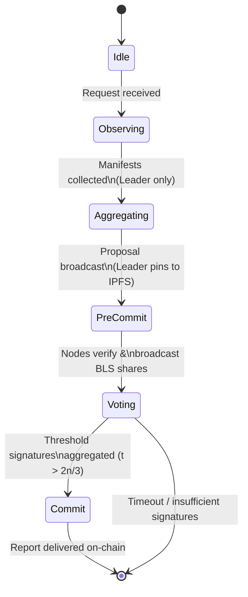
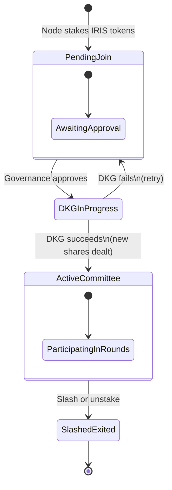
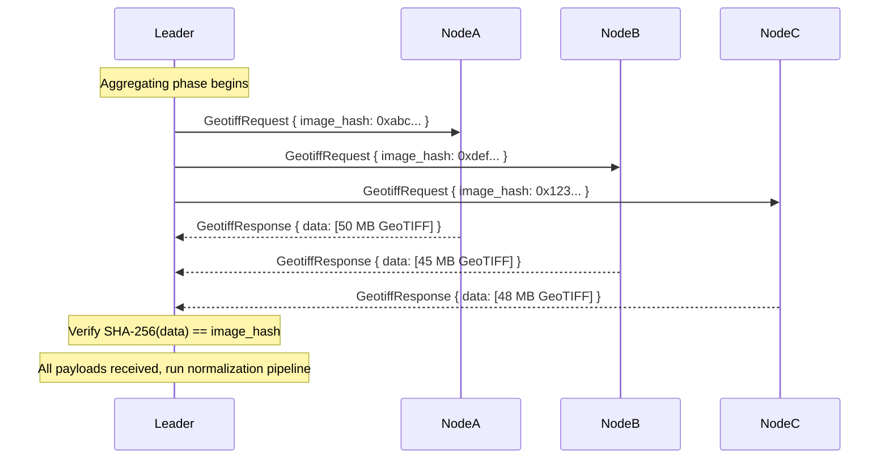
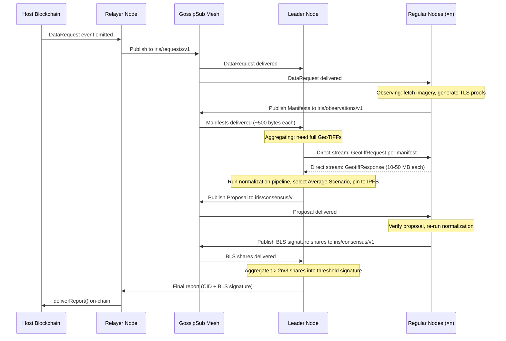

# Iris Protocol Architecture

This document defines the architecture of the Iris Protocol, a proprietary, standalone Decentralized Terrestrial Satellite Oracle Network (DtsON). Iris enables decentralized applications (dapps) to reliably ingest, verify, and utilize Geographical Information System (GIS) data, such as satellite imagery.

---

## 1. System Overview

Iris operates as an independent decentralized network specifically optimized for rich data types like imagery. Unlike early oracle models that relied solely on singular numerical values or basic off-chain reporting, Iris employs a custom Byzantine Fault Tolerant consensus mechanism (**Iris-BFT**) to securely reach agreement on the provenance and similarity of satellite imagery.

The network fetches imagery off-chain, proves the authenticity of the data source without trusting the node, mathematically calculates the "Average Scenario" using tensor comparison algorithms, and reports the verified data back to a host blockchain via threshold signatures.

---

## 2. The Geodesic Reconstruction Model

Before diving into subsystems it helps to have a mental model for *what the state machine is actually building*.

### 2.1 The Analogy: A Sphere of Flat Panels

Imagine the Earth as a geodesic sphere — not a smooth continuous surface, but a polyhedron assembled from many discrete **flat panels** (like a Buckminster Fuller dome projected around the entire globe). Each panel covers a bounded patch of the planet's surface — an **Area of Interest (AoI)** — defined by a bounding box and a point in time.

When a dapp requests satellite data for a specific location, the Iris network is essentially being asked to **reconstruct one panel** of this sphere. The reconstruction pipeline works as follows:

1. **Multiple nodes independently photograph the same panel** by fetching satellite imagery from different constellations (Maxar, Planet, Sentinel). Each photograph is a slightly different perspective of the same physical surface — different viewing angles, different spectral sensitivities, different times of day.
2. **The Data Normalization Engine aligns all photographs** into a shared coordinate space via orthorectification, then computes pairwise Similarity Scores ($\mathcal{S}$) to measure how close each photograph is to every other.
3. **The Average Scenario is selected** — the single photograph that is mathematically most similar to the consensus pool. This image becomes the panel's canonical reconstruction: the best available estimate of what that patch of Earth actually looks like.
4. **The panel is finalized** when the committee threshold-signs the reconstruction's IPFS CID and delivers it on-chain.

Over time, as dapps request data for different locations and timestamps, the network accumulates a growing mosaic of verified panels — an ever-expanding geodesic reconstruction of the Earth's surface, each facet independently verified by decentralized consensus.

### 2.2 Why This Analogy Matters

The geodesic model clarifies several architectural decisions:

* **Panels are discrete and bounded.** The state machine does not attempt to reconstruct the entire Earth at once. Each consensus round produces exactly one panel for one AoI at one timestamp. This keeps round complexity constant regardless of network scale.
* **Panels are independently verifiable.** Each panel carries its own CID, its own BLS threshold signature, and its own set of TLS provenance proofs. A consumer can verify a single panel without trusting the rest of the mosaic.
* **Resolution is demand-driven.** The geodesic sphere has no fixed tessellation. Panels are created where dapps request them. A heavily-monitored agricultural region might have hundreds of tightly-packed panels; an open ocean might have none. The "resolution" of the reconstruction is driven entirely by on-chain demand.
* **Temporal layering.** The same AoI can have multiple panels at different timestamps, creating a temporal stack — a time-series of verified reconstructions for the same location.

---

## 3. State Machine Architecture

The Iris state machine operates at **four nested layers**, each tracking different aspects of the system. Understanding these layers is essential to understanding what the node software is actually doing at any given moment.

### 3.1 Layer 1 — Round State (per-request lifecycle)

The innermost and most active layer. Every incoming `DataRequest` event from a host blockchain spawns a new **Round**. A round is the atomic unit of work in Iris: it begins with a request and ends with either a finalized panel (success) or a timeout (failure).

The round progresses through a strict finite state machine:



#### State Definitions

| State | Who is active | What is being tracked | Exit condition |
|-------|--------------|----------------------|----------------|
| **Idle** | All nodes | Subscription to `iris/requests/v1`. The node is listening for the next `DataRequest` event from the blockchain relayer or GossipSub. | A valid `DataRequest` is received and the node determines the Leader for this round via the election algorithm. |
| **Observing** | All regular nodes | Each node independently: (1) fetches imagery from its assigned satellite provider, (2) generates a TLS provenance proof via TLSNotary, (3) parses the GeoTIFF into a tensor, (4) constructs a lightweight `Manifest` containing `{image_hash, bounding_box, timestamp, tls_proof_hash, node_signature}`, and (5) publishes the manifest to `iris/observations/v1`. The node tracks: which providers it queried, the local file path of the cached GeoTIFF, the `.tlsn` proof path, and its own manifest. | The node has published its manifest AND the observation window timer expires (e.g., 30 seconds). |
| **Aggregating** | Leader node only | The Leader collects all manifests from `iris/observations/v1`. For each manifest, the Leader requests the full GeoTIFF payload via a direct libp2p stream (the Bitswap-like transfer protocol). Once all payloads are retrieved, the Leader runs the full normalization pipeline: orthorectification → similarity metrics ($\mu_1$, $\mu_2$, $\mu_3$) → exponential decay scoring $\mathcal{S}(\mu)$ → pairwise similarity matrix → Average Scenario selection. The Leader tracks: the similarity matrix, the selected Average Scenario tensor, and its corresponding image hash. | The Leader has computed the Average Scenario and pinned it to IPFS, obtaining a CID. |
| **Pre-Commit** | Leader broadcasts, all nodes listen | The Leader publishes a `Proposal` message to `iris/consensus/v1` containing: `{request_id, selected_image_hash, ipfs_cid, similarity_matrix_summary, leader_signature}`. Each regular node independently verifies the proposal by: (1) checking the TLS proof for the selected image, (2) fetching the proposed GeoTIFF via libp2p stream, (3) re-running the tensor normalization pipeline locally to confirm the similarity scores, and (4) verifying the IPFS CID matches. The node tracks: verification result (accept/reject), its own partial BLS signature (if accepted). | Each node has either broadcast a BLS signature share to `iris/consensus/v1` (accept) or broadcast a rejection (reject). |
| **Voting** | Leader collects | The Leader collects BLS signature shares from `iris/consensus/v1`. It tracks: which nodes have responded, the count of accepts vs. rejects, the partial signatures received. | The Leader has collected $t$ valid signature shares (where $t > 2n/3$), OR the voting timer expires. |
| **Commit** | Leader finalizes | The Leader aggregates $t$ partial BLS signatures into a single 48-byte threshold signature. The Relayer module submits the final report `{request_id, ipfs_cid, aggregated_bls_signature}` to the `IrisVerifier` smart contract on the host blockchain. The round is now finalized. The node tracks: the finalized CID, the aggregated signature, the transaction hash of the on-chain delivery. | The on-chain transaction is confirmed, OR the round is marked as failed (insufficient signatures / timeout). |

#### Round State Data Structure (Conceptual)

```rust
struct Round {
    // Identity
    request_id:       RequestId,
    round_number:     u64,
    leader:           PeerId,
    am_i_leader:      bool,

    // Current position in the FSM
    state:            RoundState,  // enum { Idle, Observing, Aggregating, PreCommit, Voting, Commit }

    // Observation phase
    my_manifest:      Option<Manifest>,
    peer_manifests:   HashMap<PeerId, Manifest>,
    fetched_tensors:  HashMap<ImageHash, AlignedTensor>,  // Leader only

    // Aggregation phase (Leader only)
    similarity_matrix: Option<Array2<f64>>,
    average_scenario:  Option<AverageScenario>,  // { image_hash, ipfs_cid, tensor }

    // Commit phase
    proposal:          Option<Proposal>,
    signature_shares:  HashMap<PeerId, BlsSignatureShare>,
    final_signature:   Option<BlsSignature>,
    verification:      Option<VerificationResult>,  // Regular nodes: did I accept the proposal?

    // Timing
    phase_deadline:    Instant,
}
```

### 3.2 Layer 2 — Node State (persistent, per-node)

This layer persists across rounds. It represents the node's long-lived identity and operational status.

| State field | What it tracks | Mutated when |
|------------|----------------|-------------|
| **Identity** | `ed25519` keypair, derived `PeerId`, BLS private key share | Node first boot (keypair generated) or DKG ceremony (BLS share issued) |
| **Committee Membership** | List of known committee members, their `PeerId`s, stake weights, BLS public key shares, and the aggregate public key | DKG ceremony completes after a committee change |
| **Provider Credentials** | API keys/tokens for satellite providers (Maxar, Planet, Sentinel) | Configured by operator in `iris.toml` |
| **Local Cache** | Content-addressed store of fetched GeoTIFFs (`~/.iris/cache/<sha256>.tiff`) and TLS proofs (`~/.iris/proofs/<hash>.tlsn`) | After every successful fetch |
| **Active Rounds** | Map of `RequestId → Round` for all in-progress rounds. A node may participate in multiple concurrent rounds | New request arrives / round finalizes |
| **Peer Table** | Kademlia routing table + GossipSub mesh peers | Continuously, via libp2p discovery |

### 3.3 Layer 3 — Panel State (the reconstruction output)

Each finalized round produces a **Panel** — one facet of the geodesic reconstruction. The panel is the primary output artifact of the Iris network and what dapps ultimately consume.

```rust
struct Panel {
    // What patch of Earth does this panel represent?
    bounding_box:     BoundingBox,     // Geographic coordinates (lat/lon corners)
    timestamp:        DateTime<Utc>,    // When the imagery was captured

    // The reconstruction
    ipfs_cid:         String,           // Content Identifier for the Average Scenario GeoTIFF
    image_hash:       ImageHash,        // SHA-256 of the finalized image

    // Provenance chain
    tls_proofs:       Vec<TlsProofRef>, // References to the TLS proofs of contributing nodes
    contributing_nodes: Vec<PeerId>,    // Which nodes provided imagery for this panel
    similarity_scores: Vec<f64>,        // Each contributor's similarity score to the Average Scenario

    // Cryptographic seal
    bls_signature:    BlsSignature,     // Threshold signature from >2/3 of the committee
    aggregate_pubkey: BlsPublicKey,     // The committee's aggregate public key at time of signing

    // On-chain anchor
    request_id:       RequestId,        // Links back to the originating smart contract event
    chain_tx_hash:    Option<TxHash>,   // The on-chain transaction that delivered this panel
}
```

Panels are immutable once committed. If the same AoI is requested again at a later time, a new panel is created — it does not overwrite the old one. This creates the **temporal layering** described in the geodesic model.

### 3.4 Layer 4 — Committee State (network-wide, slow-moving)

The committee is the set of staked, authorized nodes that participate in consensus. This state changes infrequently — only when operators join, leave, or are slashed.

| State field | What it tracks | Mutated when |
|------------|----------------|-------------|
| **Active Set** | The ordered list of `(PeerId, stake_weight)` tuples for all nodes currently eligible to participate in rounds | A node stakes/unstakes via the `IrisStaking` smart contract |
| **Aggregate Public Key** | The BLS12-381 aggregate public key representing the committee. Stored both off-chain (in each node's config) and on-chain (in `IrisVerifier.sol`) | DKG ceremony completes after a committee change |
| **Threshold ($t$)** | The minimum number of signature shares required: $t > \lfloor 2n/3 \rfloor$ | Committee size changes |
| **Epoch** | A monotonically increasing counter that increments with each committee change. Ensures stale signatures from old committees cannot be replayed | `updateCommittee()` is called on-chain |

#### Committee Lifecycle



---

## 4. Network Layer

Iris is built on its own peer-to-peer (P2P) networking stack to remove dependencies on external oracle infrastructures. The network layer is responsible for peer discovery, authenticated communication, message propagation, and large-payload transfer between nodes. Understanding how these sub-layers compose is essential to understanding how consensus messages, manifests, and imagery flow through the system.

### 4.1 Protocol Stack

The Iris network stack is built entirely on `rust-libp2p` and composes several protocol behaviours into a single multiplexed connection between any two peers. The layering looks like this:

```
┌─────────────────────────────────────────────────────────┐
│                   Application Layer                     │
│  ┌─────────────┐ ┌──────────────┐ ┌──────────────────┐  │
│  │  GossipSub   │ │   Kademlia   │ │ RequestResponse  │  │
│  │  (pub/sub)   │ │    (DHT)     │ │ (/iris/geotiff)  │  │
│  └──────┬───────┘ └──────┬───────┘ └────────┬─────────┘  │
│         │                │                  │            │
│  ┌──────┴────────────────┴──────────────────┴─────────┐  │
│  │              Identify Protocol                     │  │
│  │   (exchange PeerId, agent string, listen addrs)    │  │
│  └────────────────────────┬───────────────────────────┘  │
├────────────────────────────┼────────────────────────────┤
│                  Multiplexing Layer                     │
│  ┌────────────────────────┴───────────────────────────┐  │
│  │                    Yamux                            │  │
│  │   (multiple logical streams over one connection)   │  │
│  └────────────────────────┬───────────────────────────┘  │
├────────────────────────────┼────────────────────────────┤
│                   Security Layer                        │
│  ┌────────────────────────┴───────────────────────────┐  │
│  │               Noise Protocol (XX)                  │  │
│  │   (mutual authentication + encryption via ed25519) │  │
│  └────────────────────────┬───────────────────────────┘  │
├────────────────────────────┼────────────────────────────┤
│                  Transport Layer                        │
│  ┌────────────────────────┴───────────────────────────┐  │
│  │               TCP/IP + DNS Resolution              │  │
│  └────────────────────────────────────────────────────┘  │
└─────────────────────────────────────────────────────────┘
```

Every connection between two Iris nodes traverses this entire stack. A single TCP connection is upgraded through Noise, multiplexed through Yamux, and then hosts multiple concurrent protocol streams — a Kademlia lookup, a GossipSub mesh link, and a GeoTIFF transfer can all share the same underlying socket.

### 4.2 Transport & Security

| Layer | Technology | Purpose |
|-------|-----------|---------|
| **Transport** | TCP/IP with DNS resolution | Reliable, ordered byte-stream transport. DNS allows nodes to advertise human-readable addresses (`/dns4/bootnode.iris.network/tcp/9000`) alongside raw IPs |
| **Multiplexing** | Yamux | Stream multiplexer that enables multiple logical streams over a single TCP connection. Each protocol (Kademlia, GossipSub, RequestResponse, Identify) opens its own Yamux sub-stream without requiring a new TCP handshake |
| **Encryption** | Noise Protocol Framework (XX handshake) | Every connection is encrypted and mutually authenticated. During the handshake, both peers prove possession of their `ed25519` private keys. The resulting Noise session provides forward-secure symmetric encryption for all data on the wire |
| **Identity** | ed25519 keypairs → `PeerId` | A node's `PeerId` is the multihash of its ed25519 public key. This creates a one-to-one binding between network identity and cryptographic identity — there is no way to impersonate a `PeerId` without holding the corresponding private key |

#### Why This Matters for Iris

The identity binding is security-critical. When a node receives a BLS signature share from `PeerId X`, the Noise layer has already proven that the connection terminates at the holder of the ed25519 key whose hash is `X`. No additional authentication is needed at the application layer. Similarly, TLS provenance proofs are bound to the signing node's `PeerId`, creating an unbroken chain: **satellite API → TLS proof → node identity → BLS signature share → on-chain verification**.

### 4.3 Peer Discovery (Kademlia DHT)

Iris uses a Kademlia Distributed Hash Table for decentralized peer discovery. The Kademlia DHT does not store application data — it is used exclusively for finding other Iris nodes.

#### Bootstrap Process

When a new node starts for the first time:

1. **Load bootstrap addresses.** The node reads a list of well-known bootstrap `Multiaddr` values from `iris.toml`. These are hosted by the Iris Foundation initially and are the only hardcoded entry points into the network.
2. **Dial bootstraps.** The node establishes TCP connections to each bootstrap peer, performs the Noise handshake, and runs the Identify protocol to exchange agent strings, listen addresses, and protocol versions.
3. **Kademlia bootstrap.** The node issues a Kademlia `FIND_NODE` query for its own `PeerId`. This self-lookup populates its routing table by discovering nodes that are close in XOR distance.
4. **Random walks.** Periodically (every 30 seconds), the node queries a random `PeerId` to further populate its routing table and maintain diverse connections across the keyspace.
5. **Steady state.** Once the routing table contains enough peers, the node can discover any other node in $O(\log n)$ hops without relying on the bootstrap nodes.

#### Routing Table

The Kademlia routing table organizes peers into **k-buckets** by XOR distance from the local node's `PeerId`. Each bucket holds up to $k = 20$ peers. The table provides $O(\log n)$ lookup guarantees for a network of $n$ nodes. For Iris's expected committee sizes (10–100 nodes), this means any node can be located in 1–2 hops.

### 4.4 Message Propagation (GossipSub v1.1)

GossipSub is the pub/sub layer that propagates lightweight messages across the network. Iris uses GossipSub v1.1, which includes peer scoring and flood publishing to harden the mesh against Sybil and eclipse attacks.

#### Topic Architecture

Iris defines three GossipSub topics, each carrying a specific message type at a specific phase of the round:

| Topic | Message Type | Payload Size | Published By | Consumed By | Round Phase |
|-------|-------------|-------------|-------------|-------------|-------------|
| `iris/requests/v1` | `DataRequest` | ~200 bytes | Relayer (one node) | All nodes | `Idle → Observing` |
| `iris/observations/v1` | `Manifest` | ~500 bytes | All regular nodes | Leader node | `Observing` |
| `iris/consensus/v1` | `Proposal` / `BLSShare` / `Rejection` | ~300–800 bytes | Leader (Proposal) / Regular nodes (BLSShare) | All nodes | `PreCommit → Voting → Commit` |

> **Critical design decision:** Full GeoTIFF payloads (10–50 MB each) are **never** published to GossipSub. Gossiping a 50 MB file to a 20-node mesh would produce ~1 GB of total network traffic per observation per node. Instead, only lightweight manifests (~500 bytes) are gossiped. The Leader retrieves full payloads via direct streams (Section 4.5) only when needed.

#### Mesh Topology

GossipSub v1.1 maintains a mesh of $D = 6$ peers per topic (configurable via `iris.toml`). The mesh parameters are:

| Parameter | Value | Rationale |
|-----------|-------|-----------|
| $D$ (target mesh degree) | 6 | Balances redundancy against bandwidth. Each message is forwarded to 6 peers |
| $D_{low}$ (minimum mesh degree) | 4 | Below this, the node GRAFTs additional peers into the mesh |
| $D_{high}$ (maximum mesh degree) | 12 | Above this, the node PRUNEs excess peers to limit fan-out |
| $D_{lazy}$ (gossip factor) | 6 | Number of peers to whom the node sends `IHAVE` control messages for messages not directly forwarded |
| Heartbeat interval | 1 second | How often the node evaluates mesh health and peer scores |
| Message TTL | 120 seconds | Messages older than this are dropped and not forwarded |

#### Peer Scoring

GossipSub v1.1's peer scoring system is essential for Iris's Byzantine resistance at the network layer. Each peer is assigned a score based on:

* **Message delivery rate** — Peers that consistently deliver valid, timely messages score higher. Peers that flood invalid messages are penalized.
* **Mesh participation** — Peers that maintain stable mesh connections without excessive GRAFT/PRUNE churn are rewarded.
* **IP colocation penalty** — Multiple peers sharing the same IP range receive a penalty, reducing the effectiveness of Sybil attacks from a single data center.
* **Application-specific scoring** — Iris can inject custom scoring logic: for example, penalizing peers that publish manifests with invalid signatures or TLS proof hashes that fail verification.

Peers whose score drops below a configurable threshold are disconnected from the mesh and eventually blacklisted from the topic entirely.

#### Message Serialization

All GossipSub messages are serialized using **serde-cbor** (Concise Binary Object Representation). CBOR was chosen over Protobuf for the MVP because:

* It is schema-free, simplifying rapid iteration during development.
* It is self-describing, making debugging easier.
* The `serde` ecosystem in Rust provides zero-cost serialization with `#[derive(Serialize, Deserialize)]`.

A migration to Protobuf (with schema enforcement) is an open decision for post-testnet hardening.

### 4.5 Direct Streams — GeoTIFF Transfer Protocol

GossipSub is designed for small, fan-out messages. Satellite imagery is neither small nor fan-out — the Leader needs to pull specific GeoTIFFs from specific peers. Iris uses a custom `RequestResponse` protocol for this purpose.

#### Protocol Definition

| Field | Value |
|-------|-------|
| Protocol ID | `/iris/geotiff/1.0.0` |
| Transport | libp2p `RequestResponse` behaviour over the existing Yamux-multiplexed connection |
| Request payload | `GeotiffRequest { image_hash: ImageHash }` — the SHA-256 hash of the desired GeoTIFF, as advertised in the sender's manifest |
| Response payload | `GeotiffResponse { data: Vec<u8> }` — the raw GeoTIFF bytes, streamed in chunks |
| Timeout | 60 seconds |
| Max payload size | 100 MB |

#### Transfer Flow



The Leader opens parallel direct streams to all contributing nodes simultaneously (via `tokio` tasks). Each stream is a dedicated Yamux sub-stream — they do not interfere with each other or with GossipSub traffic on the same connection.

#### Integrity Verification

Upon receiving a GeoTIFF payload, the Leader:

1. Computes `SHA-256(payload)` and verifies it matches the `image_hash` from the sender's manifest.
2. Checks that the manifest's `tls_proof_hash` references a valid, verifiable TLS proof (either cached locally or fetched from the sender via a separate request).
3. Parses the GeoTIFF into the `ndarray`-based tensor representation and stores it in the local cache (`~/.iris/cache/<sha256>.tiff`).

If any verification step fails, the payload is discarded and the contributing node's peer score is penalized.

### 4.6 Message Lifecycle — A Complete Round

To illustrate how all network sub-layers interact during a single consensus round:



Notice the two distinct bandwidth regimes:

* **GossipSub traffic** (lightweight, fan-out): `DataRequest` (~200 B) → `Manifest` (~500 B × n) → `Proposal` (~800 B) → `BLSShare` (~300 B × n). For a 20-node committee, total GossipSub traffic per round is under **50 KB**.
* **Direct stream traffic** (heavy, point-to-point): The Leader pulls ~50 MB × n GeoTIFFs. For a 20-node committee, this is ~**1 GB** — but it flows only to the Leader, not to every peer. During PreCommit verification, regular nodes may also pull the proposed GeoTIFF (~50 MB each) via direct stream from the Leader.

This two-tier design keeps the GossipSub mesh fast and lightweight while allowing the Leader to handle bulk data transfer via dedicated point-to-point channels.

### 4.7 Network State Data Structure (Conceptual)

The network layer maintains its own persistent state that lives alongside the Node State (Section 3.2):

```rust
struct NetworkState {
    // Identity & transport
    local_peer_id:    PeerId,
    keypair:          ed25519::Keypair,
    listen_addresses: Vec<Multiaddr>,       // e.g., /ip4/0.0.0.0/tcp/9000

    // Discovery
    bootstrap_addrs:  Vec<Multiaddr>,       // From iris.toml
    kademlia_table:   KademliaRoutingTable, // k-buckets of known peers
    connected_peers:  HashSet<PeerId>,      // Currently connected peers

    // GossipSub mesh state (per topic)
    mesh: HashMap<TopicHash, MeshState>,
    peer_scores: HashMap<PeerId, f64>,      // GossipSub v1.1 peer scores

    // Direct streams
    pending_transfers: HashMap<RequestId, Vec<PendingGeotiffRequest>>,
    transfer_stats:    HashMap<PeerId, TransferMetrics>,  // bandwidth, latency
}

struct MeshState {
    topic:       TopicHash,
    mesh_peers:  HashSet<PeerId>,   // Active mesh links (target: D=6)
    fanout_peers: HashSet<PeerId>,  // Peers we publish to but aren't meshed with
    last_published: Instant,
}

struct TransferMetrics {
    bytes_sent:     u64,
    bytes_received: u64,
    avg_latency_ms: f64,
    failed_requests: u32,
}
```

### 4.8 Configuration (`iris.toml` — Network Section)

All network parameters are operator-configurable via the `[network]` section of `iris.toml`:

```toml
[network]
listen_address = "/ip4/0.0.0.0/tcp/9000"
bootstrap_peers = [
    "/dns4/boot1.iris.network/tcp/9000/p2p/12D3KooW...",
    "/dns4/boot2.iris.network/tcp/9000/p2p/12D3KooW...",
    "/dns4/boot3.iris.network/tcp/9000/p2p/12D3KooW...",
]

[network.gossipsub]
mesh_degree = 6
mesh_degree_low = 4
mesh_degree_high = 12
lazy_degree = 6
heartbeat_interval_ms = 1000
message_ttl_seconds = 120

[network.kademlia]
k_bucket_size = 20
bootstrap_interval_seconds = 30

[network.transfer]
geotiff_timeout_seconds = 60
max_payload_bytes = 104_857_600  # 100 MB
max_concurrent_transfers = 10
```

---

## 5. Data Provenance & Ingestion

To prevent man-in-the-middle attacks and ensure that the GIS data is genuine, nodes must provide cryptographically secure data provenance.

1. **API Fetching**: Regular nodes request satellite imagery from commercial APIs (e.g., Maxar, Planet, Sentinel) via asynchronous Rust workers (`tokio` + `reqwest`). All incoming imagery is standardized as multi-band GeoTIFFs to preserve geospatial metadata.
2. **TLS Proofs**: Nodes utilize multi-party computation TLS protocols (TLSNotary) during the data ingestion phase. The node acts as the *Prover*, generating a `.tlsn` cryptographic proof that the data payload was received directly from the authenticated satellite endpoint without tampering. Other nodes act as *Verifiers* to confirm authenticity.

---

## 6. Data Normalization Engine (The Reconstruction Pipeline)

Images received from different satellite constellations possess varying spectral bands, resolutions, and perspectives. Before the network can compare these images — before it can reconstruct a panel — they undergo a rigorous normalization pipeline implemented natively in Rust.

### 6.1 Orthorectification

Raw 2D imagery is projected onto a shared 3D Digital Elevation Model (DEM) sourced from SRTM tiles. This corrects for the satellite's viewing angle and the Earth's curvature, aligning all pixels into a unified target space $\mathbb{R}^{a \times N \times M}$. The result: disparate images from different satellites now occupy the same coordinate grid and can be compared element-wise.

### 6.2 Similarity Metrics

The network computes three independent metrics on aligned tensor pairs ($\bar{A}$, $\bar{B}$):

* **Mean Absolute Distance ($\mu_1$)**: Linear penalty for total absolute spatial deviation across all bands and pixels.
* **Mean Squared Error ($\mu_2$)**: Quadratic penalty that heavily punishes localized, extreme anomalies (e.g., malicious pixel manipulation) while being forgiving of uniform noise.
* **Spectral Angle Mapper ($\mu_3$)**: The N-dimensional angle between pixel vectors. Isolates changes in actual physical materials (spectral signature) while being completely blind to changes in illumination or shadow intensity.

### 6.3 Similarity Scoring

The three metrics are combined into a single Similarity Score via a physics-based exponential decay function:

$$\mathcal{S}(\mu) = 100 \cdot e^{-(\beta_1 \mu_1 + \beta_2 \mu_2 + \beta_3 \mu_3)}$$

The $\beta$ tuning vector controls how aggressively each type of error destroys the similarity score. Defaults are defined in config and empirically tuned during testnet.

### 6.4 Average Scenario Selection

Given $n$ observations from $n$ nodes, the Leader computes all $\binom{n}{2}$ pairwise Similarity Scores, builds a similarity matrix, and selects the image with the highest mean similarity to all others. This image — the **Average Scenario** — becomes the panel's canonical reconstruction.

> **Note:** For the complete mathematical formulation and definitions of the tensors used in this pipeline, refer to the [Data Normalization Specification](./data_normalization.md).

---

## 7. Consensus Engine (Iris-BFT)

The Iris-BFT consensus drives the Round State Machine (Section 3.1). Its role is to coordinate the network through the observation, aggregation, and signing phases for each panel reconstruction.

### 7.1 Leader Election

A deterministic, stake-weighted round-robin algorithm selects the Leader for each round:

```
leader_index = hash(block_hash ‖ request_id) % total_stake
```

The index is mapped to the node whose cumulative stake range covers that value. Because the inputs (block hash, request ID) are publicly known, every node independently computes the same Leader without extra communication.

### 7.2 Observation Window

After a request arrives, nodes have a configurable window (default: 30 seconds) to fetch imagery, generate TLS proofs, and publish their manifests. Manifests are lightweight — they contain only the image hash, bounding box, TLS proof hash, and node signature. Full GeoTIFFs are never gossiped.

### 7.3 Aggregation & Proposal

The Leader collects manifests, retrieves full GeoTIFFs via direct streams, runs the normalization pipeline, selects the Average Scenario, pins it to IPFS, and broadcasts a `Proposal` containing the CID and similarity evidence.

### 7.4 Verification & Signing

Regular nodes independently verify the proposal by re-running the normalization pipeline on the proposed image. If the verification passes, they broadcast a BLS partial signature. The Leader collects $t > 2n/3$ shares and aggregates them into a single threshold signature.

### 7.5 Threshold Cryptography

* **Curve**: BLS12-381.
* **Key Generation**: Distributed Key Generation (DKG) via Feldman's VSS is run only during committee changes — not per-request. The ceremony produces one aggregate public key and $n$ private key shares.
* **Aggregation**: $t$-of-$n$ partial signatures combine into a single 48-byte BLS signature that is verifiable by anyone holding the aggregate public key.

---

## 8. Smart Contract Integration

While the heavy computation (fetching, TLS proof generation, tensor comparisons) happens off-chain, the final results must be verifiable on-chain for dapps to consume.

* **Iris Verifier Contract**: Deployed on target host chains (e.g., Ethereum, Polygon), this contract is seeded with the network's aggregate public key and the current epoch counter.
* **Report Delivery**: The Relayer module submits `deliverReport(requestId, ipfsCid, signature)`. The contract recreates the message digest from `requestId` and `ipfsCid`, then verifies the BLS signature against the stored aggregate public key via precompile (EIP-2537) or a Solidity BLS library.
* **Tokenomics (Staking & Slashing)**: Node operators must stake IRIS tokens to join the active committee. Dapps pay request fees that are distributed to honest nodes (those whose similarity scores exceeded the threshold). Nodes providing anomalous data or invalid TLS proofs have their stakes slashed.
* **Dapp Callback**: Upon successful verification, the contract calls `targetContract.onIrisDataReceived(requestId, ipfsCid)` via the `IIrisReceiver` interface, injecting the verified panel into the dapp's ecosystem.
* **Data Distillation**: External networks (like Chainlink DONs) can query the Iris API Gateway to ingest verified GIS data and distill it into simpler numerical attributes for smart contracts.

---

## 9. How the Layers Connect — A Full Request Walkthrough

To tie everything together, here is a single request traced through all four state layers:

1. **Committee State** is already established: 7 staked nodes have completed DKG, the aggregate public key is registered on-chain, $t = 5$.
2. A dapp emits a `DataRequest` event on Ethereum. The **Relayer** picks it up and publishes it to `iris/requests/v1`.
3. Each node's **Node State** spawns a new **Round** (Layer 1). The round enters `Idle → Observing`.
4. In `Observing`, each node fetches imagery, generates a TLS proof, and publishes a manifest. The **Node State** caches the GeoTIFF locally.
5. The elected Leader's round transitions to `Aggregating`. The Leader retrieves all GeoTIFFs, runs the normalization pipeline, selects the Average Scenario, and pins it to IPFS.
6. The Leader's round transitions to `Pre-Commit` and broadcasts the proposal.
7. Regular nodes verify and transition to `Voting`, broadcasting their BLS signature shares.
8. The Leader collects 5 shares, aggregates them, and transitions to `Commit`.
9. The Relayer submits the report on-chain. The **Panel** (Layer 3) is now finalized — one more facet of the geodesic sphere.
10. **Committee State** is unchanged (no nodes joined or left this round). The round is cleaned up from each node's **Node State**.