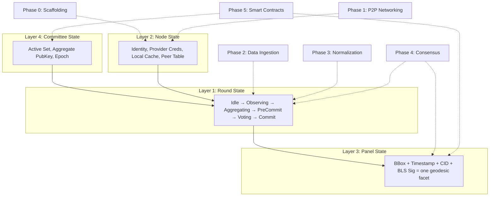
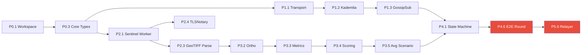

# Iris Protocol — Detailed Execution Plan

> Granular engineering breakdown of [implementation_plan.md](./implementation_plan.md). Each task is scoped to a single PR / merge-able unit of work.
> For the full state machine architecture and the Geodesic Reconstruction Model, see [architecture.md](./architecture.md).

---

## Legend

| Symbol | Meaning |
|--------|---------|
| 🔴 | Critical path — blocks downstream phases |
| 🟡 | Important but parallelizable |
| 🟢 | Can be deferred to hardening/testnet |
| `[Pn.m]` | Phase.Task ID for dependency tracking |

---

## Architectural Context: How Phases Map to State Layers

The [architecture](./architecture.md) defines four nested state layers. Every task in this plan builds toward populating one or more of these layers:



| Phase | Primary state layer affected | What it builds |
|-------|------------------------------|----------------|
| **Phase 0** | Layer 2 (Node) | The `NodeIdentity`, config system, and shared types that persist across rounds |
| **Phase 1** | Layer 2 (Node) | The Peer Table, GossipSub mesh, and transport — the nervous system that connects nodes |
| **Phase 2** | Layer 1 (Round) | The `Observing` state — fetching imagery, generating TLS proofs, publishing manifests |
| **Phase 3** | Layer 1 (Round) | The `Aggregating` state — orthorectification, similarity metrics, Average Scenario selection |
| **Phase 4** | Layers 1 + 3 (Round → Panel) | The full FSM that drives a round from `Idle` to `Commit`, producing a finalized Panel |
| **Phase 5** | Layers 3 + 4 (Panel + Committee) | On-chain verification that seals the Panel, plus the staking/slashing that governs Committee membership |

---

## Phase 0: Project Scaffolding & CI

> **Goal**: Establish the Rust workspace, CI pipeline, and shared primitives before any feature work begins.

Phase 0 builds **Layer 2 (Node State)** from scratch. The `iris-core` crate defines the foundational types — `NodeIdentity`, `ImageHash`, `BoundingBox`, `Manifest`, `RequestId` — that every other crate depends on. These types are the vocabulary of the entire system: they appear in GossipSub messages, in the Round struct, in the Panel output, and in the on-chain report. Getting them right here avoids cascading refactors later. The crate boundaries (`iris-network`, `iris-data`, `iris-normalize`, `iris-consensus`) directly mirror the architectural layers so that compile-time module boundaries enforce the separation of concerns.

### `[P0.1]` 🔴 Initialize Cargo Workspace

| Field | Detail |
|---|---|
| **What** | Create a Cargo workspace with member crates: `iris-node` (binary), `iris-network`, `iris-data`, `iris-normalize`, `iris-consensus`, `iris-contracts` |
| **Why** | Clean crate boundaries enforce the architectural layers from [architecture.md](file:///Users/sal/salsquared/iris/docs/architecture.md) and enable parallel compilation |
| **Deliverables** | `Cargo.toml` (workspace root), one `lib.rs` stub per crate, `README.md` update |
| **Acceptance** | `cargo build --workspace` compiles; `cargo test --workspace` passes (trivial tests) |
| **Effort** | 0.5 day |
| **Depends on** | Nothing |

### `[P0.2]` 🟡 CI / Linting / Formatting

| Field | Detail |
|---|---|
| **What** | GitHub Actions workflow: `cargo fmt --check`, `cargo clippy -- -D warnings`, `cargo test --workspace`, code coverage via `cargo-llvm-cov` |
| **Deliverables** | `.github/workflows/ci.yml` |
| **Acceptance** | PRs are gated on green CI |
| **Effort** | 0.5 day |
| **Depends on** | `[P0.1]` |

### `[P0.3]` 🔴 Shared Primitives Crate (`iris-core`)

| Field | Detail |
|---|---|
| **What** | Types shared across all crates: `NodeIdentity` (wrapping `ed25519` keypair + `PeerId`), `IrisConfig` (TOML-deserialized node config), `ImageHash`, `BoundingBox`, `Manifest`, `RequestId`, error types |
| **Key Crates** | `ed25519-dalek`, `serde`, `toml`, `thiserror` |
| **Deliverables** | `iris-core/src/{identity.rs, config.rs, types.rs, error.rs}` |
| **Acceptance** | Unit tests for serialization round-trips; `NodeIdentity::generate()` produces valid keypair |
| **Effort** | 1 day |
| **Depends on** | `[P0.1]` |

---

## Phase 1: P2P Networking Foundation

> **Goal**: Nodes can discover each other, authenticate, and propagate messages.

Phase 1 completes **Layer 2 (Node State)** by building the Peer Table and transport infrastructure. Without this layer, nodes are isolated — they cannot discover each other, cannot exchange manifests during the `Observing` state, and cannot propagate proposals or signature shares during `PreCommit`/`Voting`. The three GossipSub topics (`iris/requests/v1`, `iris/observations/v1`, `iris/consensus/v1`) are the communication channels that the Round State Machine in Phase 4 will use to drive state transitions. The direct stream protocol (`/iris/geotiff/1.0.0`) is the heavy-lift channel the Leader uses during `Aggregating` to pull full GeoTIFF payloads from contributing nodes — these are too large for gossip and must be exchanged point-to-point.

### `[P1.1]` 🔴 libp2p Transport & Authentication

| Field | Detail |
|---|---|
| **What** | Stand up a `libp2p::Swarm` with TCP + Yamux + Noise. On startup, load or generate an `ed25519` keypair from disk, derive `PeerId` |
| **Key Crates** | `libp2p` (features: `tcp`, `yamux`, `noise`, `dns`, `identify`) |
| **Deliverables** | `iris-network/src/{transport.rs, swarm.rs}` |
| **Acceptance** | Two local nodes connect over TCP, Noise handshake succeeds, `Identify` protocol exchanges `PeerId` and agent strings |
| **Effort** | 2 days |
| **Depends on** | `[P0.3]` |

### `[P1.2]` 🔴 Kademlia DHT & Bootstrap

| Field | Detail |
|---|---|
| **What** | Enable the Kademlia behaviour. Hardcode 3 bootstrap `Multiaddr` values in config. Implement `discover_peers()` that runs a Kademlia bootstrap + random walk |
| **Key Crates** | `libp2p-kad` |
| **Deliverables** | `iris-network/src/discovery.rs`, bootstrap node addresses in `iris.toml` |
| **Acceptance** | 5-node local cluster (via `cargo run` with different ports) — every node discovers all others within 10 s |
| **Effort** | 1.5 days |
| **Depends on** | `[P1.1]` |

### `[P1.3]` 🔴 GossipSub Topics

| Field | Detail |
|---|---|
| **What** | Configure GossipSub v1.1 with three topic subscriptions: `iris/requests/v1`, `iris/observations/v1`, `iris/consensus/v1`. Implement typed publish/subscribe wrappers that serialize `Manifest`, `DataRequest`, `ConsensusMessage` via protobuf or serde-cbor |
| **Key Crates** | `libp2p-gossipsub`, `prost` or `serde_cbor` |
| **Deliverables** | `iris-network/src/{gossip.rs, messages.rs, codecs.rs}` |
| **Acceptance** | Integration test: Node A publishes a `DataRequest`, Nodes B and C receive & deserialize it correctly |
| **Effort** | 2 days |
| **Depends on** | `[P1.2]` |

### `[P1.4]` 🟡 Direct Stream (Bitswap-like) for GeoTIFFs

| Field | Detail |
|---|---|
| **What** | Implement a custom `RequestResponse` protocol (`/iris/geotiff/1.0.0`) for point-to-point large-payload exchange. The Leader requests a GeoTIFF by `ImageHash`; the holder streams it back in chunks |
| **Key Crates** | `libp2p-request-response`, `tokio::io` |
| **Deliverables** | `iris-network/src/transfer.rs` |
| **Acceptance** | Transfer a 50 MB test GeoTIFF between two local nodes; hash of received file matches original |
| **Effort** | 2 days |
| **Depends on** | `[P1.1]` |

### `[P1.5]` 🟢 Network Metrics & Observability

| Field | Detail |
|---|---|
| **What** | Expose Prometheus metrics: peer count, gossip message rate, bandwidth per topic, Kademlia routing table size. Integrate `tracing` with structured JSON logs |
| **Key Crates** | `prometheus`, `tracing`, `tracing-subscriber` |
| **Deliverables** | `iris-network/src/metrics.rs`, Grafana dashboard JSON |
| **Acceptance** | `curl localhost:9090/metrics` returns valid Prometheus exposition format |
| **Effort** | 1 day |
| **Depends on** | `[P1.3]` |

---

## Phase 2: Data Ingestion & Provenance

> **Goal**: Nodes fetch satellite imagery and prove it hasn't been tampered with.

Phase 2 implements everything that happens during the **`Observing` state** of a consensus round. When the Round FSM transitions from `Idle` to `Observing`, the node must: (1) call a satellite provider API, (2) simultaneously run the TLS session through TLSNotary to generate a provenance proof, (3) parse the downloaded GeoTIFF into a tensor and cache it locally (updating **Node State** Layer 2), and (4) assemble a lightweight `Manifest` and publish it to `iris/observations/v1`. The manifest is the node's attestation: "I fetched this image, here is its hash, here is proof it came from the real API." This is the raw material that the Leader will consume in Phase 3's `Aggregating` state.

### `[P2.1]` 🔴 Provider Abstraction & Sentinel Worker

| Field | Detail |
|---|---|
| **What** | Define a `trait SatelliteProvider { async fn fetch(&self, bbox: BoundingBox, time_range: TimeRange) -> Result<GeoTiffPayload>; }`. Implement for **Sentinel (Copernicus)** first (free, no API key friction) |
| **Key Crates** | `reqwest`, `tokio`, `serde_json` |
| **Deliverables** | `iris-data/src/{provider.rs, sentinel.rs, types.rs}` |
| **Acceptance** | CLI command `iris-node fetch --provider sentinel --bbox "..." --time "..."` downloads a valid GeoTIFF to local storage |
| **Effort** | 2 days |
| **Depends on** | `[P0.3]` |

### `[P2.2]` 🟡 Maxar & Planet Workers

| Field | Detail |
|---|---|
| **What** | Implement `SatelliteProvider` for Maxar SecureWatch and Planet PlanetScope APIs |
| **Deliverables** | `iris-data/src/{maxar.rs, planet.rs}` |
| **Acceptance** | Integration tests (gated behind `--features commercial-api` flag and env-var API keys) fetch real imagery |
| **Effort** | 2 days |
| **Depends on** | `[P2.1]` |

### `[P2.3]` 🔴 GeoTIFF Parsing & Local Storage

| Field | Detail |
|---|---|
| **What** | Parse multi-band GeoTIFFs into the `ndarray`-based tensor representation `Array3<f64>` of shape `(bands, height, width)`. Store raw files in a content-addressed local cache (`~/.iris/cache/<sha256>.tiff`) |
| **Key Crates** | `gdal` (Rust bindings), `ndarray`, `sha2` |
| **Deliverables** | `iris-data/src/{geotiff.rs, cache.rs}` |
| **Acceptance** | Round-trip test: write a synthetic 3-band GeoTIFF → parse → verify tensor values and CRS metadata |
| **Effort** | 2 days |
| **Depends on** | `[P2.1]` |

### `[P2.4]` 🔴 TLSNotary Integration

| Field | Detail |
|---|---|
| **What** | Wrap the TLSNotary Rust prover library. During `SatelliteProvider::fetch`, run the TLS session through TLSNotary to produce a `.tlsn` proof alongside the GeoTIFF. Implement a `verify_tlsn_proof()` function for the verifier path |
| **Key Crates** | `tlsn-prover`, `tlsn-verifier` (from the [TLSNotary](https://github.com/tlsnotary/tlsn) project) |
| **Deliverables** | `iris-data/src/{prover.rs, verifier.rs}` |
| **Acceptance** | End-to-end test: fetch from Sentinel with TLSNotary, produce proof, verify proof — all pass |
| **Open Risks** | TLSNotary Rust SDK maturity; may need to pin a specific commit. Fallback: run the prover as a sidecar process |
| **Effort** | 4 days |
| **Depends on** | `[P2.1]` |

### `[P2.5]` 🟡 Manifest Construction

| Field | Detail |
|---|---|
| **What** | After fetch + proof, assemble a `Manifest { image_hash, bounding_box, timestamp, tls_proof_hash, node_signature }` and publish it on `iris/observations/v1` |
| **Deliverables** | `iris-data/src/manifest.rs`, updates to `iris-network/src/gossip.rs` |
| **Acceptance** | Full pipeline: fetch → prove → build manifest → gossip → peer receives and deserializes |
| **Effort** | 1 day |
| **Depends on** | `[P2.3]`, `[P2.4]`, `[P1.3]` |

---

## Phase 3: Data Normalization Engine

> **Goal**: Implement the tensor math pipeline from [data_normalization.md](./data_normalization.md) in pure Rust.

Phase 3 is the mathematical core of the **`Aggregating` state**. This is where the Geodesic Reconstruction Model becomes concrete: the Leader takes $n$ raw photographs of a single panel (Area of Interest), aligns them into a shared coordinate space via orthorectification, computes pairwise similarity using three independent metrics ($\mu_1$, $\mu_2$, $\mu_3$), scores each pair with the exponential decay function $\mathcal{S}(\mu)$, and selects the Average Scenario — the single image that best represents consensus reality. This pipeline also runs on regular nodes during `PreCommit` when they independently verify the Leader's proposal. Correctness here is critical: if two honest nodes disagree on the similarity score for the same tensor pair, the consensus round fails.

### `[P3.1]` 🔴 DEM Fetching & Caching

| Field | Detail |
|---|---|
| **What** | Fetch SRTM DEM tiles for a given bounding box. Cache tiles locally. Parse the HGT format into an `Array2<f64>` height map |
| **Key Crates** | `reqwest`, `ndarray`, `gdal` |
| **Deliverables** | `iris-normalize/src/dem.rs` |
| **Acceptance** | Given a bbox, return a height array; second call serves from cache |
| **Effort** | 1.5 days |
| **Depends on** | `[P0.3]` |

### `[P3.2]` 🔴 Orthorectification Pipeline

| Field | Detail |
|---|---|
| **What** | Implement the transformation operator $\mathcal{T}$ — project the raw GeoTIFF tensor onto the DEM using GDAL's warping API via Rust bindings, resampling to the unified target space $\mathbb{R}^{a \times N \times M}$ |
| **Key Crates** | `gdal` |
| **Deliverables** | `iris-normalize/src/ortho.rs` |
| **Acceptance** | Two synthetic GeoTIFFs with different CRS inputs produce tensors of identical shape and aligned coordinates |
| **Effort** | 3 days |
| **Depends on** | `[P3.1]`, `[P2.3]` |

### `[P3.3]` 🔴 Similarity Metrics ($\mu_1$, $\mu_2$, $\mu_3$)

| Field | Detail |
|---|---|
| **What** | Implement the three core metrics on aligned `Array3<f64>` tensors: Mean Absolute Distance, Mean Squared Error, Spectral Angle Mapper. Return feature vector $\mu = [\mu_1, \mu_2, \mu_3]^T$ |
| **Key Crates** | `ndarray` |
| **Deliverables** | `iris-normalize/src/metrics.rs` |
| **Acceptance** | Property tests: identical tensors → $\mu = [0,0,0]$; known synthetic differences → expected metric values within $\epsilon$ |
| **Effort** | 2 days |
| **Depends on** | `[P3.2]` |

### `[P3.4]` 🔴 Similarity Score $\mathcal{S}(\mu)$

| Field | Detail |
|---|---|
| **What** | Implement the exponential decay scoring function $\mathcal{S}(\mu) = 100 \cdot e^{-(\beta_1\mu_1 + \beta_2\mu_2 + \beta_3\mu_3)}$. Load default $\beta$ vector from `iris.toml` config |
| **Deliverables** | `iris-normalize/src/scoring.rs`, `iris.toml` additions |
| **Acceptance** | $\mathcal{S}([0,0,0]) = 100$; increasing any $\mu_i$ strictly decreases the score |
| **Effort** | 0.5 day |
| **Depends on** | `[P3.3]` |

### `[P3.5]` 🟡 Average Scenario Selection

| Field | Detail |
|---|---|
| **What** | Given $n$ aligned tensors, compute all pairwise $\mathcal{S}$ scores, build a similarity matrix, and select the tensor with the highest mean similarity to all others as the Average Scenario |
| **Deliverables** | `iris-normalize/src/aggregator.rs` |
| **Acceptance** | With 5 nearly-identical tensors + 1 outlier, the outlier is never selected |
| **Effort** | 1.5 days |
| **Depends on** | `[P3.4]` |

---

## Phase 4: Consensus Engine (Iris-BFT)

> **Goal**: Coordinate the full request lifecycle — from on-chain event to signed CID delivery.

Phase 4 is the orchestrator — it implements the **Round State Machine (Layer 1)** that drives a request through all six states (`Idle → Observing → Aggregating → PreCommit → Voting → Commit`) and produces a finalized **Panel (Layer 3)**. The FSM consumes the networking layer (Phase 1) for communication, the data layer (Phase 2) for observation, and the normalization layer (Phase 3) for aggregation. It adds Leader Election (so nodes agree on who aggregates without extra messages), BLS Threshold Signatures (so the committee can produce a single compact cryptographic seal), and IPFS pinning (so the Average Scenario GeoTIFF is permanently available). When a round reaches `Commit`, the output is a complete Panel: `{bounding_box, timestamp, ipfs_cid, bls_signature}` — one facet of the geodesic sphere.

### `[P4.1]` 🔴 State Machine

| Field | Detail |
|---|---|
| **What** | Implement the 5-state FSM: `Idle → Observing → Aggregating → PreCommit → Commit`. Use an `enum RoundState` with typed transitions. Each state transition is event-driven via a `tokio::mpsc` channel |
| **Deliverables** | `iris-consensus/src/{state.rs, round.rs}` |
| **Acceptance** | Unit test drives the FSM through a happy-path round with mock inputs |
| **Effort** | 3 days |
| **Depends on** | `[P1.3]`, `[P3.5]` |

### `[P4.2]` 🔴 Leader Election

| Field | Detail |
|---|---|
| **What** | Deterministic, stake-weighted round-robin: `leader_index = hash(block_hash ∥ request_id) % total_stake`, mapped to the node whose cumulative stake range covers that index. Every node computes this independently |
| **Deliverables** | `iris-consensus/src/election.rs` |
| **Acceptance** | Given fixed stakes + block hash, all nodes agree on the same leader. Property test: distribution is proportional to stake over many rounds |
| **Effort** | 1 day |
| **Depends on** | `[P0.3]` |

### `[P4.3]` 🔴 BLS Threshold Signatures

| Field | Detail |
|---|---|
| **What** | Implement BLS12-381 sign, verify, and aggregate operations. Build a `ThresholdSigner` that holds a private key share and produces partial signatures. Build a `ThresholdAggregator` (Leader-side) that collects $t$-of-$n$ partials and combines them |
| **Key Crates** | `blst` (supranational's BLS library — fast, audited) |
| **Deliverables** | `iris-consensus/src/{bls.rs, threshold.rs}` |
| **Acceptance** | Generate $n=7$ key shares with $t=5$ threshold → any 5 partials aggregate into a valid signature verifiable by the aggregate public key; any 4 fail |
| **Effort** | 3 days |
| **Depends on** | `[P0.3]` |

### `[P4.4]` 🟡 Distributed Key Generation (DKG)

| Field | Detail |
|---|---|
| **What** | Implement Feldman's VSS-based DKG protocol over GossipSub. Triggered only during committee formation (node join/leave). Produces key shares + aggregate public key |
| **Key Crates** | `blst`, custom protocol messages |
| **Deliverables** | `iris-consensus/src/dkg.rs` |
| **Acceptance** | 5-node local cluster completes DKG in < 30 s; all nodes derive the same aggregate public key |
| **Open Risks** | Async DKG is notoriously complex. Fallback for MVP: trusted dealer ceremony |
| **Effort** | 5 days |
| **Depends on** | `[P4.3]`, `[P1.3]` |

### `[P4.5]` 🔴 IPFS Pinning

| Field | Detail |
|---|---|
| **What** | HTTP client to a local IPFS daemon or Pinata API. Leader uploads the Average Scenario GeoTIFF, retrieves the CID |
| **Key Crates** | `reqwest`, `serde_json` |
| **Deliverables** | `iris-consensus/src/storage.rs` |
| **Acceptance** | Upload a test file → retrieve CID → `ipfs cat <CID>` returns identical bytes |
| **Effort** | 1 day |
| **Depends on** | `[P0.3]` |

### `[P4.6]` 🔴 End-to-End Consensus Round

| Field | Detail |
|---|---|
| **What** | Wire the full pipeline: request event → FSM drives through all states → manifests exchanged → Leader fetches GeoTIFFs via Bitswap → normalizes → selects Average Scenario → pins to IPFS → nodes sign → Leader aggregates BLS signature |
| **Deliverables** | Integration test in `iris-node/tests/consensus_round.rs` |
| **Acceptance** | 5-node local cluster completes a full round and produces a valid `(CID, BLS signature)` tuple |
| **Effort** | 4 days |
| **Depends on** | `[P4.1]`, `[P4.2]`, `[P4.3]`, `[P4.5]`, `[P3.5]`, `[P2.5]`, `[P1.4]` |

---

## Phase 5: Smart Contract Verifier

> **Goal**: On-chain verification of off-chain consensus + tokenomics.

Phase 5 anchors **Layer 3 (Panel State)** to the blockchain and implements **Layer 4 (Committee State)** on-chain. The `IrisVerifier` contract is the on-chain counterpart to the off-chain consensus: it stores the committee's aggregate public key, verifies the BLS threshold signature on delivered reports, and updates the on-chain state so dapps can consume the verified CID. The staking/slashing contracts manage Committee membership — nodes must lock IRIS tokens to join, and misbehavior (anomalous data, invalid TLS proofs) results in stake reduction. The Relayer module bridges the two worlds: it watches the blockchain for `DataRequest` events (triggering the off-chain Round FSM) and submits finalized `(CID, signature)` tuples back on-chain (sealing the Panel).

### `[P5.1]` 🔴 Foundry Project Setup

| Field | Detail |
|---|---|
| **What** | Initialize a Foundry project under `iris-contracts/`. Set up `foundry.toml`, install OpenZeppelin contracts as a dependency |
| **Deliverables** | `iris-contracts/{foundry.toml, src/, test/, script/}` |
| **Acceptance** | `forge build` compiles successfully |
| **Effort** | 0.5 day |
| **Depends on** | Nothing |

### `[P5.2]` 🔴 `IrisVerifier.sol` — Core Contract

| Field | Detail |
|---|---|
| **What** | Implement the verifier: store `aggregatePublicKey`, `updateCommittee()` (governance-gated), and `deliverReport(bytes32 requestId, string ipfsCid, bytes signature)`. Signature verification via BLS precompile (EIP-2537) or a Solidity BLS library fallback |
| **Deliverables** | `iris-contracts/src/IrisVerifier.sol` |
| **Acceptance** | Forge tests: valid signature → state updated; invalid signature → revert; unauthorized `updateCommittee` → revert |
| **Effort** | 3 days |
| **Depends on** | `[P5.1]` |

### `[P5.3]` 🔴 Staking & Slashing Module

| Field | Detail |
|---|---|
| **What** | `stake(uint256 amount)`, `unstake()` with unbonding period, `slash(address node, uint256 amount)` callable only by verifier logic. ERC-20 IRIS token integration |
| **Deliverables** | `iris-contracts/src/IrisStaking.sol`, `iris-contracts/src/IrisToken.sol` |
| **Acceptance** | Tests: stake → join committee; deliver anomalous data → slash reduces balance; unstake before unbonding → revert |
| **Effort** | 3 days |
| **Depends on** | `[P5.2]` |

### `[P5.4]` 🟡 Reward Distribution

| Field | Detail |
|---|---|
| **What** | On successful `deliverReport`, distribute the request fee proportionally to honest nodes (those whose similarity score exceeded a threshold). Implement `claimRewards()` |
| **Deliverables** | `iris-contracts/src/IrisRewards.sol` |
| **Acceptance** | Forge test: 5 nodes contribute, 1 is anomalous — anomalous node gets zero reward, others split fee proportionally |
| **Effort** | 2 days |
| **Depends on** | `[P5.3]` |

### `[P5.5]` 🟡 `IIrisReceiver.sol` Interface & Callback

| Field | Detail |
|---|---|
| **What** | Define the consumer interface. After verification, `IrisVerifier` calls `targetContract.onIrisDataReceived(requestId, ipfsCid)`. Build a sample consumer contract for testing |
| **Deliverables** | `iris-contracts/src/interfaces/IIrisReceiver.sol`, `iris-contracts/src/examples/SampleConsumer.sol` |
| **Acceptance** | End-to-end Forge test: request → deliver → consumer receives CID and emits event |
| **Effort** | 1 day |
| **Depends on** | `[P5.2]` |

### `[P5.6]` 🟡 Rust ↔ Chain Bridge (Relayer)

| Field | Detail |
|---|---|
| **What** | Rust binary or module that listens for `DataRequest` events on-chain, injects them into the Iris P2P network, and submits the final `(CID, signature)` back via `deliverReport()` |
| **Key Crates** | `ethers-rs` or `alloy` |
| **Deliverables** | `iris-node/src/relayer.rs` |
| **Acceptance** | Anvil local chain: emit `DataRequest` → Iris cluster processes → relayer submits report → on-chain state updated |
| **Effort** | 3 days |
| **Depends on** | `[P4.6]`, `[P5.2]` |

---

## Critical Path

The longest dependency chain determines the minimum calendar time:



**Critical path estimate**: ~35-40 engineering days (solo developer), or ~6–8 calendar weeks with 2 developers working the parallel tracks (networking vs. data/normalization).

---

## Risk Register

| # | Risk | Impact | Likelihood | Mitigation |
|---|------|--------|------------|------------|
| R1 | **GDAL Rust bindings** are fragile on macOS (dynamic linking to `libgdal`) | Blocks Phase 2+3 | Medium | Pin `gdal` crate version; provide a Nix flake or Docker devcontainer with pre-built GDAL |
| R2 | **TLSNotary Rust SDK** is pre-1.0 and API-unstable | Blocks Phase 2 | High | Pin to a specific git commit; write an adapter layer so internals can be swapped; fallback to sidecar process |
| R3 | **BLS precompile (EIP-2537)** not available on target chain | Blocks Phase 5 | Medium | Use a pure-Solidity BLS library (e.g., `hubble-contracts/BLS.sol`) as fallback; deploy to chains with precompile support first (Polygon) |
| R4 | **DKG protocol** is complex and hard to get right | Delays Phase 4 | High | MVP uses a trusted dealer ceremony; async DKG is a Phase 4.4 stretch goal |
| R5 | **Commercial API rate limits** during testnet | Degrades testing | Low | Default to Sentinel (free); mock providers for CI |

---

## Recommended Execution Order (Two-Track)

```
Week 1-2:  Track A: P0.1 → P0.3 → P1.1 → P1.2 → P1.3
           Track B: P0.1 → P5.1 → P5.2 (contracts can start early)

Week 3-4:  Track A: P1.4 + P1.5
           Track B: P2.1 → P2.3 → P2.4

Week 5-6:  Track A: P3.1 → P3.2 → P3.3 → P3.4 → P3.5
           Track B: P2.5 + P4.2 + P4.3

Week 7-8:  Track A: P4.1 → P4.5 → P4.6
           Track B: P5.3 → P5.4 → P5.5

Week 9:    Both:    P5.6 (Relayer) + P4.4 (DKG) + integration testing
```

---

## Open Decisions Needed

> [!IMPORTANT]
> These decisions should be resolved before or during Phase 0 to avoid rework.

1. **Target chain for MVP**: Ethereum Sepolia? Polygon Amoy? Determines BLS precompile availability and gas costs.
2. **DKG vs. trusted dealer**: Full DKG is ~5 days of work and high-risk. Is a trusted dealer acceptable for testnet?
3. **IPFS strategy**: Run a local `kubo` daemon, or use Pinata/web3.storage API? Affects `[P4.5]` implementation.
4. **Serialization format**: Protobuf (schema-enforced, smaller) vs. CBOR (schema-free, simpler)? Affects all P2P message types.
5. **Monorepo vs. polyrepo for contracts**: Keep Foundry project inside the Iris workspace, or separate repo with its own CI?
