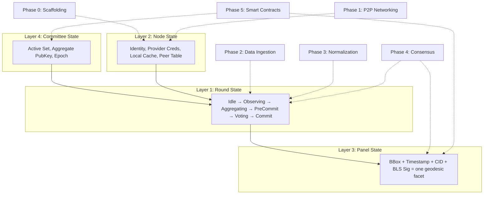
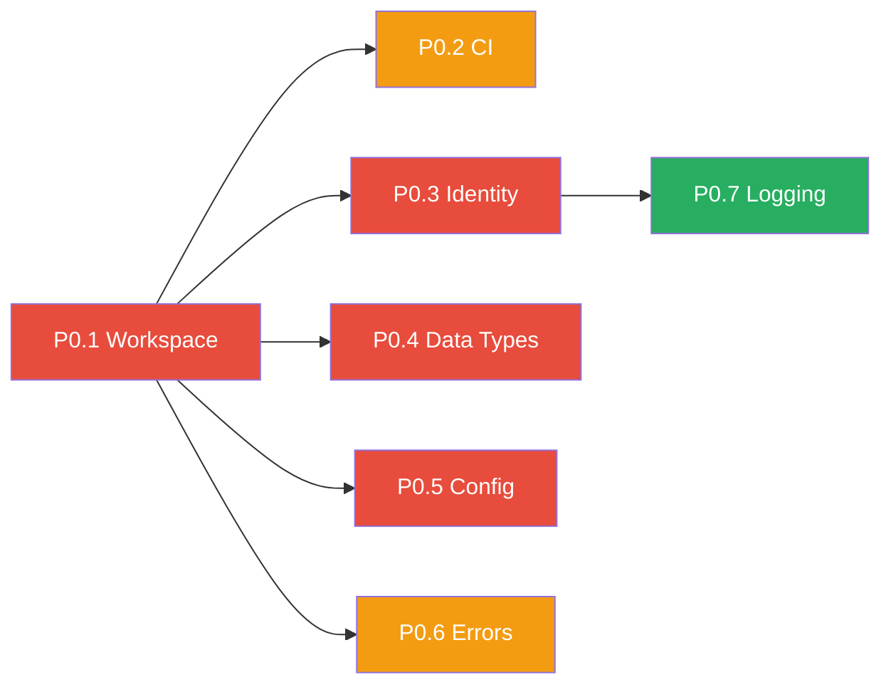

# Iris Protocol — Detailed Implementation Plan

> Granular engineering breakdown of the Iris Protocol architecture. Each task is scoped to a single PR / merge-able unit of work.
> For the full state machine architecture and the Geodesic Reconstruction Model, see [architecture.md](./architecture.md).

---

## Legend

| Symbol | Meaning |
|--------|---------|
| 🔴 | Critical path — blocks downstream phases |
| 🟡 | Important but parallelizable |
| 🟢 | Can be deferred to hardening/testnet |
| `[Pn.m]` | Phase.Task ID for dependency tracking |

---

## Architectural Context: How Phases Map to State Layers

The [architecture](./architecture.md) defines four nested state layers. Every task in this plan builds toward populating one or more of these layers:



| Phase | Primary state layer affected | What it builds |
|-------|------------------------------|----------------|
| **Phase 0** | Layer 2 (Node) | The `NodeIdentity`, config system, and shared types that persist across rounds |
| **Phase 1** | Layer 2 (Node) | The Peer Table, GossipSub mesh, and transport — the nervous system that connects nodes |
| **Phase 2** | Layer 1 (Round) | The `Observing` state — fetching imagery, generating TLS proofs, publishing manifests |
| **Phase 3** | Layer 1 (Round) | The `Aggregating` state — orthorectification, similarity metrics, Average Scenario selection |
| **Phase 4** | Layers 1 + 3 (Round → Panel) | The full FSM that drives a round from `Idle` to `Commit`, producing a finalized Panel |
| **Phase 5** | Layers 3 + 4 (Panel + Committee) | On-chain verification that seals the Panel, plus the staking/slashing that governs Committee membership |

---

## Phase 0: Project Scaffolding & CI

> **Goal**: Establish the Rust workspace, CI pipeline, and shared primitives before any feature work begins.

Phase 0 builds **Layer 2 (Node State)** from scratch. The `iris-core` crate defines the foundational types — `NodeIdentity`, `ImageHash`, `BoundingBox`, `Manifest`, `RequestId` — that every other crate depends on. These types are the vocabulary of the entire system: they appear in GossipSub messages, in the `Round` struct, in the `Panel` output, and in the on-chain report. Getting them right here avoids cascading refactors later.

The crate boundaries (`iris-network`, `iris-data`, `iris-normalize`, `iris-consensus`) directly mirror the architectural layers so that compile-time module boundaries enforce the separation of concerns described in [architecture.md](./architecture.md).

### `[P0.1]` 🔴 Initialize Cargo Workspace

| Field | Detail |
|---|---|
| **What** | Create a Cargo workspace with member crates: `iris-node` (binary), `iris-core` (shared types), `iris-network`, `iris-data`, `iris-normalize`, `iris-consensus`, `iris-contracts` |
| **Why** | Clean crate boundaries enforce the architectural layers and enable parallel compilation. The crate structure mirrors the four state layers: `iris-core` defines Layer 2 primitives, `iris-network` builds Layer 2's peer table and transport, `iris-data` and `iris-normalize` implement Layer 1's Observing and Aggregating states, `iris-consensus` drives the full Layer 1 FSM and produces Layer 3 Panels, and `iris-contracts` bridges to Layer 4 on-chain |
| **Deliverables** | `Cargo.toml` (workspace root), one `lib.rs` stub per crate, `iris-node/src/main.rs` binary entry point, `README.md` update |
| **Acceptance** | `cargo build --workspace` compiles; `cargo test --workspace` passes (trivial tests) |
| **Effort** | 0.5 day |
| **Depends on** | Nothing |

#### Implementation Notes

The workspace `Cargo.toml` should define shared dependency versions to ensure consistency across crates:

```toml
[workspace]
members = [
    "iris-node",
    "iris-core",
    "iris-network",
    "iris-data",
    "iris-normalize",
    "iris-consensus",
    "iris-contracts",
]

[workspace.dependencies]
serde = { version = "1", features = ["derive"] }
serde_json = "1"
tokio = { version = "1", features = ["full"] }
thiserror = "2"
tracing = "0.1"
```

Each crate's `Cargo.toml` should reference workspace dependencies via `serde.workspace = true` to avoid version drift.

---

### `[P0.2]` 🟡 CI / Linting / Formatting

| Field | Detail |
|---|---|
| **What** | GitHub Actions workflow: `cargo fmt --check`, `cargo clippy -- -D warnings`, `cargo test --workspace`, code coverage via `cargo-llvm-cov` |
| **Why** | Enforcing quality from the first PR prevents technical debt accumulation. Clippy's deny-warnings policy catches common Rust anti-patterns early |
| **Deliverables** | `.github/workflows/ci.yml` |
| **Acceptance** | PRs are gated on green CI; coverage report is published as an artifact |
| **Effort** | 0.5 day |
| **Depends on** | `[P0.1]` |

#### Implementation Notes

The CI workflow should include:

1. **Matrix builds**: Test on both `ubuntu-latest` and `macos-latest` (macOS is important because GDAL bindings — needed in Phase 3 — behave differently on macOS due to dynamic linking).
2. **Caching**: Use `actions/cache` for `~/.cargo/registry` and `target/` to speed up incremental builds.
3. **Coverage threshold**: Set a baseline (e.g., 70%) and fail CI if coverage drops below it once real code lands.

---

### `[P0.3]` 🔴 Core Identity Types (`iris-core/src/identity.rs`)

| Field | Detail |
|---|---|
| **What** | Implement `NodeIdentity` — the wrapper around an `ed25519` keypair that derives the node's `PeerId`. This is the cryptographic root of trust for the entire system. The `PeerId` is the multihash of the ed25519 public key, creating a one-to-one binding between network identity and cryptographic identity (see [architecture §4.2.1](./architecture.md#421-cryptographic-node-identity-peerid)) |
| **Why** | Every layer of the architecture depends on `PeerId`. It appears in: the Noise handshake (Layer 2), GossipSub messages (Layer 2), the `Manifest` (Layer 1), `Round.leader` (Layer 1), `Panel.contributing_nodes` (Layer 3), and the on-chain committee set (Layer 4). It must exist before any networking or consensus code can be written |
| **Key Crates** | `ed25519-dalek`, `multihash` |
| **Deliverables** | `iris-core/src/identity.rs` |
| **Acceptance** | `NodeIdentity::generate()` produces a valid keypair. `NodeIdentity::from_file(path)` loads an existing keypair from disk. `identity.peer_id()` returns a deterministic `PeerId` derived from the public key. Serialization round-trip tests pass |
| **Effort** | 1 day |
| **Depends on** | `[P0.1]` |

#### Implementation Notes

The `NodeIdentity` struct should support two construction paths:

```rust
/// First boot: generate a new identity and persist to disk.
pub fn generate(key_path: &Path) -> Result<Self>;

/// Subsequent boots: load the existing private key from disk.
pub fn from_file(key_path: &Path) -> Result<Self>;
```

The private key file should be stored at `~/.iris/identity.key` with `0600` file permissions. The `PeerId` is derived via `multihash(public_key_bytes)`, matching the libp2p convention so that the identity created here is directly usable in Phase 1 when the `libp2p::Swarm` is initialized.

---

### `[P0.4]` 🔴 Core Data Types (`iris-core/src/types.rs`)

| Field | Detail |
|---|---|
| **What** | Define the shared domain types that appear across all crates. These types are extracted directly from the data structures defined in [architecture §3](./architecture.md#3-state-machine-architecture) |
| **Why** | These types form the vocabulary of the entire protocol. Every GossipSub message, every Round computation, every Panel output, and every on-chain report is built from these primitives. Defining them once in `iris-core` ensures consistency and prevents divergent definitions across crates |
| **Key Crates** | `serde`, `blake2`, `chrono` |
| **Deliverables** | `iris-core/src/types.rs` |
| **Acceptance** | All types implement `Serialize`, `Deserialize`, `Clone`, `Debug`. Serialization round-trip tests pass for every type. `ImageHash::from_bytes()` produces correct BLAKE2b digests |
| **Effort** | 1.5 days |
| **Depends on** | `[P0.1]` |

#### Types to Implement

The following types map directly to the architecture's state layer definitions:

**Hashing & Content Addressing:**
- `ImageHash` — A BLAKE2b-256 digest wrapper. The architecture specifies BLAKE2b as the core hashing algorithm (see [architecture §10.1](./architecture.md#101-cryptographic-compute-hashing)) for its 512-bit post-quantum security margin and ~1 GB/s throughput on modern CPUs. `ImageHash` is used in manifests, the local cache path (`~/.iris/cache/<blake2b>.tiff`), and in the `/iris/geotiff/1.0.0` direct stream request payload.

**Geospatial Primitives:**
- `BoundingBox` — Geographic coordinates (lat/lon corners) defining one Panel's Area of Interest. Appears in `Manifest`, `Panel`, and `DataRequest`.
- `TimeRange` — The temporal window for imagery capture. Used to query Data Provider APIs.

**Protocol Identifiers:**
- `RequestId` — Unique identifier for a data request originating from a host blockchain smart contract. Links the on-chain `DataRequest` event to the off-chain consensus round.

**Observation Types:**
- `Manifest` — The lightweight attestation a Regular Node publishes to `iris/observations/v1` after fetching imagery. Contains: `{ image_hash: ImageHash, bounding_box: BoundingBox, timestamp: DateTime<Utc>, tls_proof_hash: ImageHash, node_signature: Vec<u8> }`. This is ~500 bytes and is the only observation data that touches the GossipSub mesh — the full GeoTIFF payload is exchanged only via direct streams.
- `DataRequest` — The on-chain request that triggers a consensus round. Published to `iris/requests/v1` by the Relayer. ~200 bytes.

**Consensus Types:**
- `Proposal` — The Leader Node's proposed Average Scenario, published to `iris/consensus/v1` during the `PreCommit` state. Contains: `{ request_id, selected_image_hash, ipfs_cid, similarity_matrix_summary, leader_signature }`. ~800 bytes.
- `ConsensusMessage` — Enum wrapping `Proposal`, `BLSShare`, and `Rejection` variants for type-safe deserialization of `iris/consensus/v1` messages.

**Panel Output (Layer 3):**
- `Panel` — The primary output of a finalized consensus round. One facet of the geodesic reconstruction. Contains: `{ bounding_box, timestamp, image_hash, tls_proofs, contributing_nodes, similarity_scores, bls_signature, aggregate_pubkey, request_id }` (see [architecture §3.3](./architecture.md#33-layer-3--panel-state-the-reconstruction-output)).

**Round State (Layer 1):**
- `RoundState` — The FSM enum: `{ Idle, Observing, Aggregating, PreCommit, Voting, Commit }`.

---

### `[P0.5]` 🔴 Configuration System (`iris-core/src/config.rs`)

| Field | Detail |
|---|---|
| **What** | Implement `IrisConfig` — a TOML-deserialized node configuration struct that governs all runtime behavior. The architecture defines specific configuration sections for networking, GossipSub, Kademlia, and transfer parameters (see [architecture §4.8](./architecture.md#48-configuration-iris-toml--network-section)) |
| **Why** | Every phase depends on configurable parameters: bootstrap peer addresses (Phase 1), GossipSub mesh degree (Phase 1), GeoTIFF timeout windows of up to 3600 seconds (Phase 1), API provider credentials (Phase 2), $\beta$ scoring weights (Phase 3), and observation window durations (Phase 4). A centralized, validated config struct ensures all crates read consistent values |
| **Key Crates** | `serde`, `toml` |
| **Deliverables** | `iris-core/src/config.rs`, `iris.example.toml` (annotated reference config) |
| **Acceptance** | Deserialization of a valid `iris.toml` produces a populated `IrisConfig`. Missing required fields produce descriptive errors. Default values are applied for optional fields |
| **Effort** | 1 day |
| **Depends on** | `[P0.1]` |

#### Configuration Sections

The `IrisConfig` struct should include the following sections, derived from the architecture:

```toml
# iris.example.toml — Reference configuration for an Iris node

[identity]
key_path = "~/.iris/identity.key"     # Path to ed25519 private key

[network]
listen_address = "/ip4/0.0.0.0/tcp/9000"
bootstrap_peers = [
    "/dns4/boot1.iris.network/tcp/9000/p2p/12D3KooW...",
    "/dns4/boot2.iris.network/tcp/9000/p2p/12D3KooW...",
    "/dns4/boot3.iris.network/tcp/9000/p2p/12D3KooW...",
]

[network.gossipsub]
mesh_degree = 6           # D: target mesh peers per topic
mesh_degree_low = 4       # D_low: below this, GRAFT new peers
mesh_degree_high = 12     # D_high: above this, PRUNE excess
lazy_degree = 6           # D_lazy: IHAVE gossip recipients
heartbeat_interval_ms = 1000
message_ttl_seconds = 120

[network.kademlia]
k_bucket_size = 20
bootstrap_interval_seconds = 30

[network.transfer]
geotiff_timeout_seconds = 3600    # 1 hour for massive payloads
max_payload_bytes = 17_179_869_184  # 16 GB
max_concurrent_transfers = 10

[providers]
# API credentials for satellite imagery Data Providers
[providers.sentinel]
enabled = true
# Sentinel (Copernicus) is free — no API key needed for basic access

[providers.maxar]
enabled = false
api_key = ""

[providers.planet]
enabled = false
api_key = ""

[normalization]
# β weights for the exponential decay scoring function
# S(μ) = 100 · e^-(β₁μ₁ + β₂μ₂ + β₃μ₃)
beta_mad = 1.0    # β₁: Mean Absolute Distance weight
beta_mse = 1.0    # β₂: Mean Squared Error weight
beta_sam = 1.0    # β₃: Spectral Angle Mapper weight

[consensus]
observation_window_seconds = 30   # Time for nodes to fetch and publish manifests
voting_timeout_seconds = 60       # Time for Leader to collect BLS shares

[storage]
cache_dir = "~/.iris/cache"       # Content-addressed GeoTIFF cache
proofs_dir = "~/.iris/proofs"     # TLS provenance proofs
```

---

### `[P0.6]` 🟡 Error Types (`iris-core/src/error.rs`)

| Field | Detail |
|---|---|
| **What** | Define a unified error hierarchy using `thiserror` that covers all failure modes across the protocol: identity errors (key generation, file I/O), network errors (connection, handshake, timeout), data errors (fetch failure, parse failure, TLS proof invalid), normalization errors (GDAL binding failures, tensor shape mismatch), consensus errors (invalid proposal, insufficient signatures, timeout), and contract errors (transaction reverted, gas estimation failure) |
| **Why** | A shared error type in `iris-core` allows crates to propagate errors cleanly across boundaries without losing context. Each crate can define its own specific error variants that implement `Into<IrisError>` |
| **Key Crates** | `thiserror` |
| **Deliverables** | `iris-core/src/error.rs` |
| **Acceptance** | All error variants have descriptive messages. Errors chain via `#[from]` for automatic conversion from upstream crate errors (e.g., `std::io::Error`, `serde_json::Error`) |
| **Effort** | 0.5 day |
| **Depends on** | `[P0.1]` |

---

### `[P0.7]` 🟢 Structured Logging & Tracing

| Field | Detail |
|---|---|
| **What** | Initialize `tracing` with `tracing-subscriber` for structured JSON logging. Add span instrumentation to the binary entry point (`iris-node`) so that all log lines carry context fields like `peer_id`, `request_id`, and `round_state` as the node progresses through consensus rounds |
| **Why** | Debugging a distributed system without structured, correlated logs is extremely difficult. Setting up the tracing infrastructure in Phase 0 means all code written in subsequent phases automatically benefits from it. The `peer_id` context field is especially important — when aggregating logs from a multi-node cluster, it is the only way to distinguish which node produced which log line |
| **Key Crates** | `tracing`, `tracing-subscriber` (with `json` and `env-filter` features) |
| **Deliverables** | `iris-node/src/logging.rs`, integration into `main.rs` |
| **Acceptance** | Running `iris-node` produces structured JSON log lines to stdout. Log level is controllable via `RUST_LOG` environment variable |
| **Effort** | 0.5 day |
| **Depends on** | `[P0.3]` (needs `PeerId` for the context span) |

---

### Phase 0 Dependency Graph



**Critical path**: `[P0.1]` → `[P0.3]` + `[P0.4]` + `[P0.5]` (parallelizable once workspace exists)

**Phase 0 total effort**: ~5.5 days

---

## Phase 1: P2P Networking Foundation

> *Coming next — will implement the transport, discovery, and message propagation layers from [architecture §4](./architecture.md#4-network-layer).*

## Phase 2: Data Ingestion & Provenance

> *Coming next — will implement the TLSNotary Chain of Provenance from [architecture §5](./architecture.md#5-data-provenance--ingestion).*

## Phase 3: Data Normalization Engine

> *Coming next — will implement the tensor math pipeline from [architecture §6](./architecture.md#6-data-normalization-engine-the-reconstruction-pipeline).*

## Phase 4: Consensus Engine (Iris-BFT)

> *Coming next — will implement the Round State Machine from [architecture §7](./architecture.md#7-consensus-engine-iris-bft).*

## Phase 5: Smart Contract Verifier

> *Coming next — will implement on-chain verification from [architecture §8](./architecture.md#8-smart-contract-integration).*
